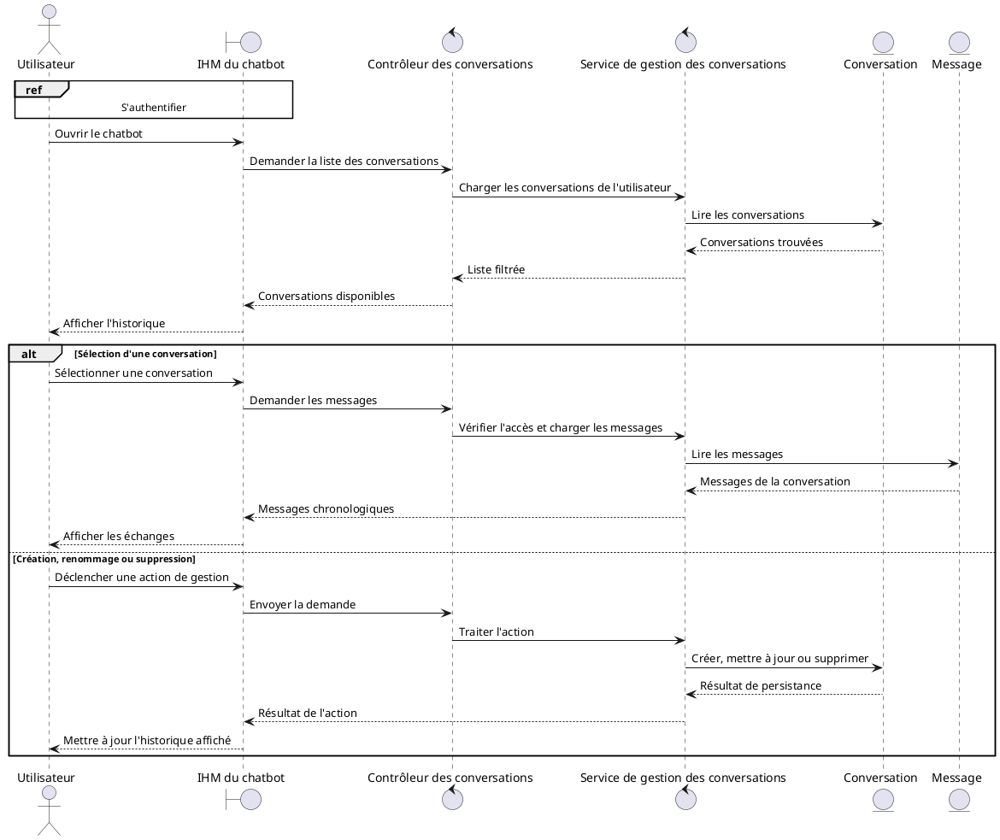
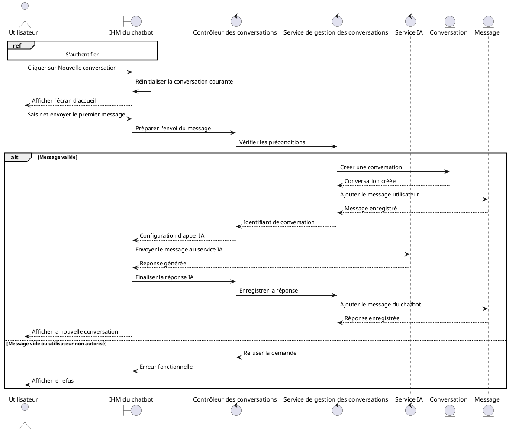
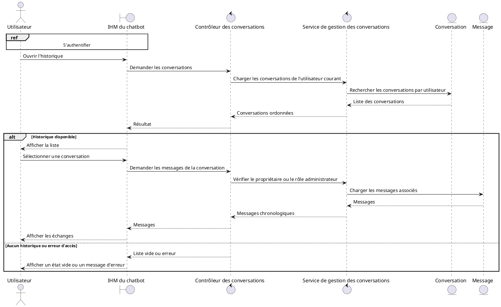
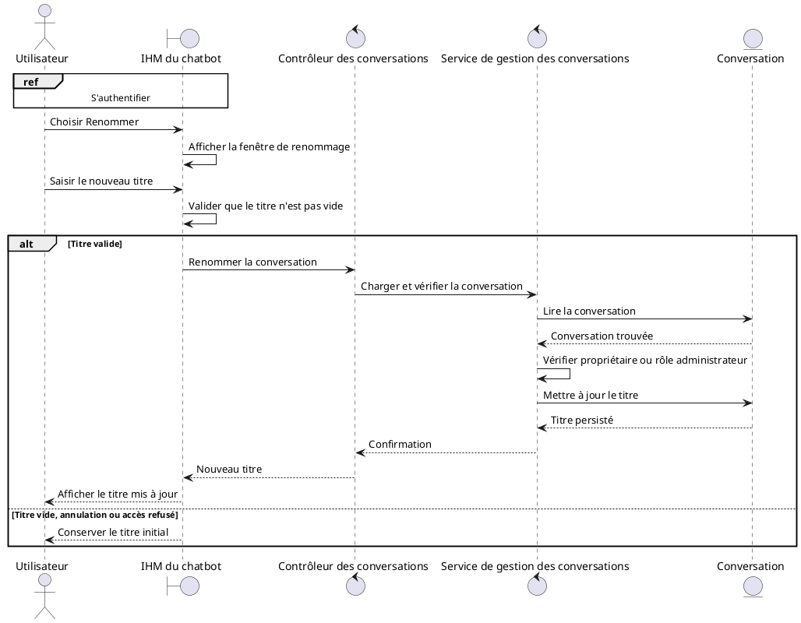
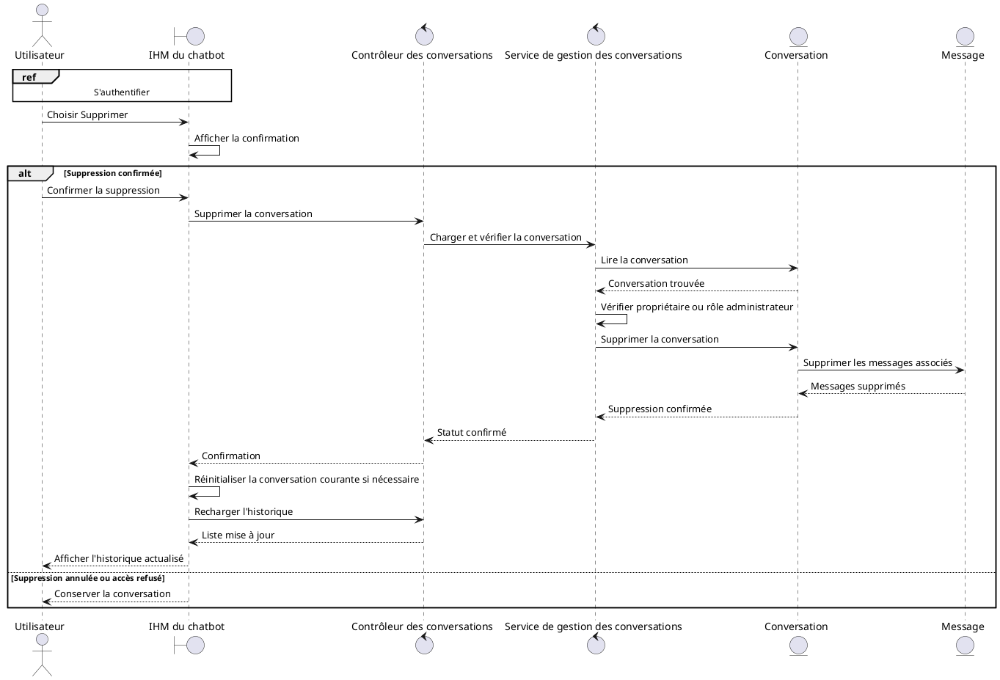

# 1. Introduction

Le Sprint IA constitue une évolution fonctionnelle du constructeur de tableaux de bord ERPNext/Frappe. Il complète les fonctionnalités de visualisation déjà assurées par les widgets KPI en ajoutant des composants intelligents capables de produire des analyses, des synthèses et des recommandations à partir des données métier.

Cette évolution repose sur deux axes principaux. Le premier concerne les widgets IA, intégrés au constructeur de tableaux de bord comme les autres widgets, mais exécutés par un service spécialisé d'analyse intelligente. Le second concerne le chatbot conversationnel, qui permet à l'utilisateur de dialoguer avec le système, de créer des conversations, de consulter l'historique, de renommer une conversation et de supprimer une conversation. L'ensemble s'appuie sur les DocTypes Frappe, les méthodes whitelistees, les services Python et les composants JavaScript présents dans le projet.

# 2. Description textuelle des cas d'utilisation

## 2.1 Gérer les conversations du chatbot

- Nom du cas d'utilisation : Gérer les conversations du chatbot
- Acteur principal : Utilisateur authentifié de l'application ERPNext/Frappe.
- Objectif : Permettre à l'utilisateur de manipuler ses conversations avec le chatbot, notamment en créant une conversation, en consultant l'historique, en modifiant le titre d'une conversation et en supprimant une conversation.
- Préconditions : L'utilisateur est connecté. L'interface du chatbot est chargée via le fichier `public/js/chatbot.js`. Les méthodes Frappe liées au chatbot sont disponibles, notamment `get_conversations`, `get_messages`, `rename_conversation`, `delete_conversation`, `prepare_stream_v2` et `finish_stream_v2`.
- Postconditions : L'état affiché dans l'IHM du chatbot est synchronisé avec les conversations persistées dans le DocType `Chatbot Conversation` et avec les messages stockés dans le DocType enfant `Chatbot Message`.
- Scénario nominal : L'utilisateur ouvre l'IHM du chatbot. L'interface charge la liste des conversations avec `get_conversations`. L'utilisateur peut sélectionner une conversation pour consulter ses messages, démarrer une nouvelle conversation, renommer une conversation ou demander sa suppression. Les actions sont transmises aux contrôleurs Python, qui vérifient l'accès, manipulent les DocTypes concernés, puis retournent le résultat à l'interface.
- Scénarios alternatifs : Si aucune conversation n'existe, l'interface affiche un état vide. Si l'utilisateur tente d'accéder à une conversation appartenant à un autre utilisateur, le contrôleur renvoie une erreur de permission, sauf pour un utilisateur possédant le rôle `System Manager`. Si une opération échoue, l'interface conserve l'état courant ou affiche un message d'erreur.

Diagramme de séquence :

## 2.2 Créer une conversation

- Nom du cas d'utilisation : Créer une conversation
- Acteur principal : Utilisateur authentifié.
- Objectif : Ouvrir une nouvelle conversation et permettre l'enregistrement du premier échange avec le chatbot.
- Préconditions : L'utilisateur est connecté. L'IHM du chatbot est disponible. Le service chatbot v2 est configuré avec `chatbot_jwt_secret` et l'URL FastAPI lorsqu'un appel IA est nécessaire.
- Postconditions : Une nouvelle ligne `Chatbot Conversation` est créée et associée à l'utilisateur courant. Le premier message utilisateur est ajouté dans la table enfant `Chatbot Message`. Lorsque la réponse IA est reçue, elle est ajoutée comme message de rôle `bot`.
- Scénario nominal : L'utilisateur clique sur `Nouvelle conversation`. Côté interface, `startNewConversation` réinitialise l'identifiant de conversation courant et affiche l'écran d'accueil. La conversation n'est réellement persistée qu'au premier message, via `prepare_stream_v2` ou `send_message_v2`. Le service `_get_or_create_conversation` crée alors un DocType `Chatbot Conversation`, lui associe `frappe.session.user`, initialise son titre à partir du premier message, renseigne `last_message_at`, puis l'insère en base. Le message utilisateur est ensuite ajouté. Dans le flux streaming, la réponse générée par le service IA est enregistrée par `finish_stream_v2`.
- Scénarios alternatifs : Si le message est vide, la création n'est pas déclenchée. Si un identifiant de conversation existant est fourni, le service réutilise cette conversation après vérification des droits. Si la conversation indiquée n'existe pas, une nouvelle conversation est créée. Si le service IA est indisponible, le message utilisateur peut être enregistré, mais l'interface affiche une erreur de connexion au service IA.

Diagramme de séquence :

## 2.3 Consulter l'historique des conversations

- Nom du cas d'utilisation : Consulter l'historique des conversations
- Acteur principal : Utilisateur authentifié.
- Objectif : Afficher la liste des conversations précédentes et consulter les messages d'une conversation sélectionnée.
- Préconditions : L'utilisateur est connecté. Des conversations peuvent exister dans `Chatbot Conversation`. L'utilisateur doit être propriétaire de la conversation ou posséder le rôle `System Manager`.
- Postconditions : La liste des conversations est affichée dans la barre latérale du chatbot. Les messages de la conversation sélectionnée sont affichés dans l'ordre stocké dans la table enfant `messages`.
- Scénario nominal : L'utilisateur ouvre le menu des conversations. La fonction JavaScript `loadConversations` appelle `custom_dashboard.chatbot.chatbot_api.get_conversations`. Le contrôleur retourne les conversations de `frappe.session.user`, ordonnées par `last_message_at` décroissant. L'utilisateur sélectionne une conversation. La fonction `loadConversation` appelle `get_messages`, qui charge le DocType `Chatbot Conversation`, vérifie l'accès et retourne les messages sous forme de couples `role`, `content` et `timestamp`. L'interface ajoute ensuite chaque message dans la zone de discussion.
- Scénarios alternatifs : Si aucune conversation n'existe, l'interface affiche `Aucune conversation`. Si l'accès à la conversation est refusé, le contrôleur lève une erreur de permission. Si le chargement des messages échoue, l'interface affiche un message d'erreur dans la zone de chat.

Diagramme de séquence :

## 2.4 Modifier le titre d'une conversation

- Nom du cas d'utilisation : Modifier le titre d'une conversation
- Acteur principal : Utilisateur authentifié.
- Objectif : Renommer une conversation existante afin de faciliter son identification dans l'historique.
- Préconditions : La conversation existe. L'utilisateur en est le propriétaire ou possède le rôle `System Manager`. Le nouveau titre saisi n'est pas vide côté interface.
- Postconditions : Le champ `title` du DocType `Chatbot Conversation` est mis à jour et l'historique affiché est rechargé.
- Scénario nominal : L'utilisateur clique sur l'action de renommage d'une conversation dans la liste. L'interface affiche une fenêtre de saisie avec le titre actuel. Après validation, `chatbot.js` appelle `custom_dashboard.chatbot.chatbot_api.rename_conversation` avec `conversation_id` et `new_title`. Le contrôleur charge la conversation, vérifie l'accès, modifie `conv.title`, sauvegarde le document avec `ignore_permissions=True`, puis confirme l'opération. L'interface met à jour le titre courant si nécessaire et recharge la liste des conversations.
- Scénarios alternatifs : Si le titre saisi est vide, aucune requête n'est envoyée. Si l'utilisateur annule la fenêtre de renommage, aucun changement n'est effectué. Si l'accès est refusé, la base de données n'est pas modifiée. Si la sauvegarde échoue, l'ancien titre reste conservé.

Diagramme de séquence :

## 2.5 Supprimer une conversation

- Nom du cas d'utilisation : Supprimer une conversation
- Acteur principal : Utilisateur authentifié.
- Objectif : Supprimer une conversation du chatbot et retirer ses messages de l'historique affiché.
- Préconditions : La conversation existe. L'utilisateur en est le propriétaire ou possède le rôle `System Manager`. L'utilisateur confirme explicitement la suppression dans l'interface.
- Postconditions : Le DocType `Chatbot Conversation` est supprimé. Les messages enfants `Chatbot Message` liés à la conversation sont supprimés avec le document parent. L'historique affiché est rechargé.
- Scénario nominal : L'utilisateur clique sur l'action de suppression d'une conversation. L'interface affiche une fenêtre de confirmation. Après confirmation, `chatbot.js` appelle `custom_dashboard.chatbot.chatbot_api.delete_conversation`. Le contrôleur charge la conversation, vérifie que l'utilisateur est autorisé, puis appelle `frappe.delete_doc` sur `Chatbot Conversation`. Après validation de la transaction, l'interface démarre une nouvelle conversation locale si la conversation supprimée était ouverte, puis recharge la liste des conversations.
- Scénarios alternatifs : Si l'utilisateur annule la confirmation, aucune suppression n'est effectuée. Si la conversation n'appartient pas à l'utilisateur, la suppression est refusée. Si la suppression échoue, l'historique affiché peut être rechargé sans perte de données.

Diagramme de séquence :

# 3. Diagramme de classes

Le diagramme suivant synthétise les principales entités du Sprint IA. Il est volontairement simplifié afin de rester lisible dans un rapport académique : les composants techniques proches sont regroupés en services fonctionnels, tout en conservant leur correspondance avec le code source.

```plantuml
@startuml
skinparam classAttributeIconSize 0
hide circle
left to right direction

package "Interface utilisateur" {
  class "Interface du chatbot" as InterfaceChatbot <<frontière>> {
    +afficherHistorique()
    +envoyerMessage()
    +renommerConversation()
    +supprimerConversation()
  }

  class "Constructeur de tableau de bord" as ConstructeurTableau <<frontière>> {
    +afficherWidgets()
    +ajouterWidgetIA()
    +régénérerAnalyse()
  }
}

package "Application Frappe" {
  class "Service des conversations" as ServiceConversations <<contrôle>> {
    +créerConversation(titre)
    +listerConversations()
    +chargerMessages(conversation)
    +renommerConversation(conversation, titre)
    +supprimerConversation(conversation)
    +envoyerMessage(message)
  }

  class "Service des widgets IA" as ServiceWidgetsIA <<contrôle>> {
    +générerAnalyseStock(filtres)
    +générerAnalyseVentes(filtres)
    +générerAnalyseAchats(filtres)
    -construireContexte(filtres)
  }

  class "Passerelle IA" as PasserelleIA <<contrôle>> {
    +lireConfiguration()
    +signerJeton()
    +envoyerRequête(données)
  }

  class "Contrôle d'accès" as ControleAcces <<contrôle>> {
    +vérifierUtilisateur()
    +vérifierRôle()
    +vérifierWidget()
  }
}

package "Service IA unique" {
  class "API IA FastAPI" as ApiIA <<contrôle>> {
    +traiterMessage(demande)
    +classerIntention(demande)
    +générerAnalyseWidget(demande)
  }

  class "Client Cohere" as ClientCohere <<contrôle>> {
    +générerRéponse(messages)
    +générerFlux(messages)
  }

  class "API Cohere" as ApiCohere <<externe>> {
    +produireRéponse()
  }
}

package "Persistance Frappe" {
  class "Utilisateur" as Utilisateur <<entité>> {
    +identifiant: texte
    +actif: booléen
  }

  class "Rôle" as Role <<entité>> {
    +nom: texte
  }

  class "Conversation" as Conversation <<entité>> {
    +identifiant: texte
    +titre: texte
    +dateDernierMessage: date
  }

  class "Message" as Message <<entité>> {
    +rôle: texte
    +contenu: texte long
    +dateCréation: date
  }

  class "Tableau de bord" as TableauBord <<entité>> {
    +identifiant: texte
    +titre: texte
  }

  class "Élément de tableau de bord" as ElementTableau <<entité>> {
    +positionX: entier
    +positionY: entier
    +largeur: entier
    +hauteur: entier
    +filtres: texte long
  }

  class "Widget" as Widget <<entité>> {
    +identifiant: texte
    +titre: texte
    +typeDeWidget: texte
    +méthodePython: texte
    +actif: booléen
  }

  class "Droit de widget" as DroitWidget <<entité>> {
    +peutVoir: booléen
    +peutUtiliser: booléen
  }
}

InterfaceChatbot ..> ServiceConversations : manipule les conversations
ConstructeurTableau ..> ServiceWidgetsIA : demande une analyse IA

ServiceConversations ..> ControleAcces : vérifie l'utilisateur
ServiceConversations ..> Conversation : crée et modifie
ServiceConversations ..> Message : enregistre les échanges
ServiceConversations ..> PasserelleIA : demande une réponse

ServiceWidgetsIA ..> ControleAcces : vérifie les droits
ServiceWidgetsIA ..> Widget : utilise la définition
ServiceWidgetsIA ..> PasserelleIA : demande une analyse

PasserelleIA ..> ApiIA : appelle le service IA unique
ApiIA ..> ClientCohere : prépare la génération
ClientCohere ..> ApiCohere : interroge Cohere

Utilisateur "1" -- "0..*" Conversation : possède
Conversation "1" *-- "0..*" Message : contient

Utilisateur "1" -- "0..*" TableauBord : possède
TableauBord "1" *-- "0..*" ElementTableau : contient
ElementTableau "0..*" --> "1" Widget : référence

Widget "1" *-- "0..*" DroitWidget : définit
DroitWidget "0..*" --> "1" Role : concerne
Utilisateur "0..*" -- "0..*" Role : possède

@enduml
```

