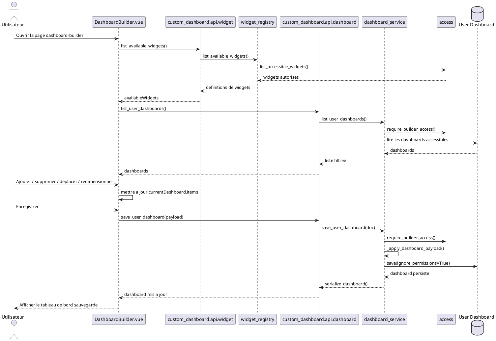
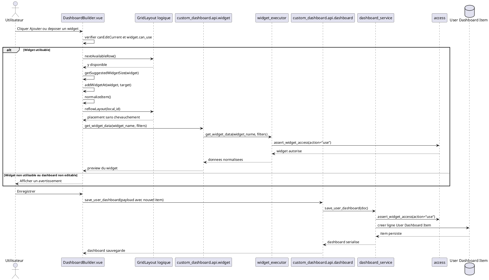
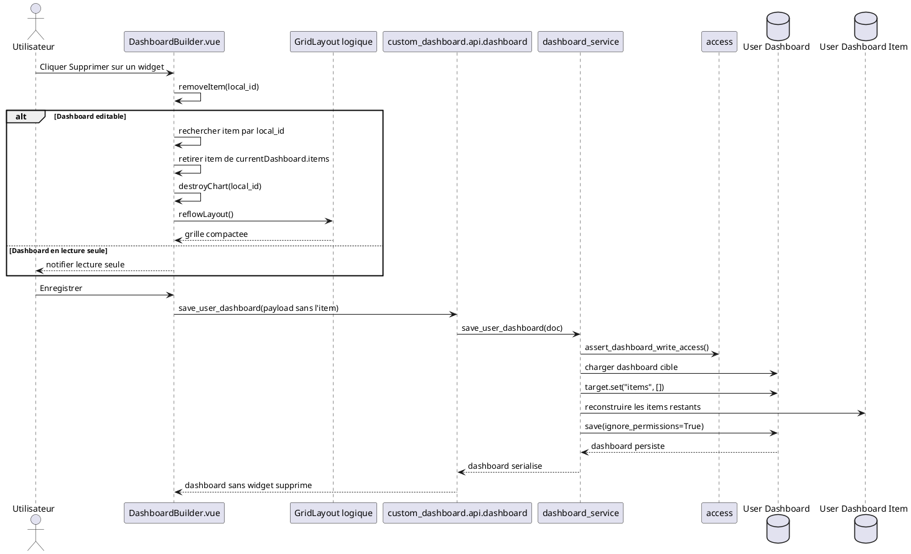
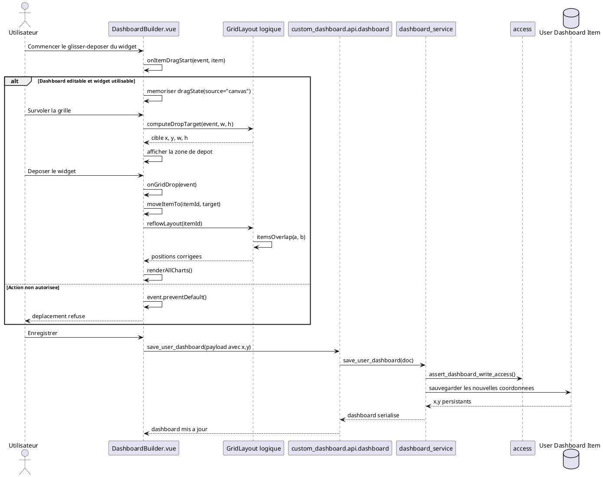
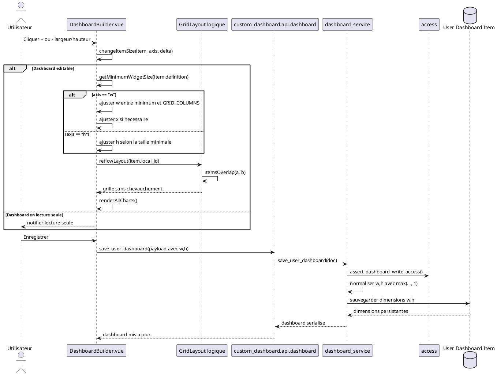

# 1. Introduction

La gestion des widgets constitue le noyau fonctionnel du constructeur de tableaux de bord. Elle permet a un utilisateur autorise de composer un tableau de bord ERPNext/Frappe a partir de widgets KPI predefinis, puis de les organiser visuellement dans une grille. Chaque widget place dans la grille conserve une position, une taille, un titre d'affichage et, si necessaire, des filtres de donnees.

Dans l'implementation analysee, le concept de tableau de bord est represente par le DocType `User Dashboard`, le concept de widget par `Custom Dashboard Widget`, et l'association entre un tableau de bord et un widget place par le DocType enfant `User Dashboard Item`. La grille n'est pas une classe persistante separee : elle est geree dans le composant Vue `DashboardBuilder.vue` au moyen d'une grille CSS de 12 colonnes, de la constante `GRID_ROW_HEIGHT = 72`, et de methodes de calcul de placement telles que `computeDropTarget`, `reflowLayout` et `itemsOverlap`.

# 2. Description textuelle des cas d'utilisation

## 2.1 Gerer les widgets

- Nom du cas d'utilisation : Gerer les widgets
- Acteur principal : Utilisateur connecte disposant d'un acces au constructeur de tableaux de bord.
- Objectif : Composer et maintenir le contenu d'un tableau de bord en ajoutant, supprimant, deplacant et redimensionnant des widgets KPI.
- Preconditions : L'utilisateur possede un role autorise par le service d'acces (`System Manager`, `Dashboard Admin`, `Dashboard Manager` ou `Dashboard Consumer`). Le tableau de bord est lisible par l'utilisateur et, pour les modifications, il doit etre editable. Les widgets disponibles doivent etre actifs et autorises pour le role de l'utilisateur.
- Scenario nominal : L'utilisateur ouvre la page `dashboard-builder`. Le composant `DashboardBuilder.vue` charge les widgets via `custom_dashboard.api.widget.list_available_widgets` et les tableaux de bord via `custom_dashboard.api.dashboard.list_user_dashboards`. L'utilisateur selectionne ou cree un tableau de bord. Il manipule les widgets dans la grille. Lors de l'enregistrement, le composant envoie la liste des items a `custom_dashboard.api.dashboard.save_user_dashboard`, qui delegue la validation et la persistance a `dashboard_service.save_user_dashboard`.
- Scenarios alternatifs : Si l'utilisateur n'a pas l'acces requis, le service `access.require_builder_access` bloque l'operation. Si le tableau de bord est en lecture seule, les actions de modification sont refusees cote interface. Si un widget est inactif ou non autorise, il n'est pas utilisable et le service `access.assert_widget_access` peut lever une erreur de permission.
- Postconditions : Les modifications sont conservees en memoire cote client. Apres enregistrement, les lignes `User Dashboard Item` du tableau de bord sont reconstruites et sauvegardees avec leurs coordonnees, dimensions, titre et filtres.

Diagramme de sequence :

## 2.2 Ajouter un widget

- Nom du cas d'utilisation : Ajouter un widget
- Acteur principal : Utilisateur autorise a modifier le tableau de bord courant.
- Objectif : Inserer un widget disponible dans la grille du tableau de bord.
- Preconditions : Le tableau de bord courant est editable (`can_write`). Le widget est visible et utilisable pour le role de l'utilisateur (`can_use`). Si le tableau de bord est associe a un module, le widget doit appartenir au meme module.
- Scenario nominal : L'utilisateur clique sur le bouton `Ajouter` d'une carte de la bibliotheque ou glisse le widget vers la grille. La methode `addWidget` calcule la prochaine ligne disponible avec `nextAvailableRow`, puis determine une taille suggeree avec `getSuggestedWidgetSize`. La methode `addWidgetAt` cree un item normalise contenant `widget`, `x`, `y`, `w`, `h`, `display_title` et `filters_json`. L'item est ajoute a `currentDashboard.items`, le layout est reordonne avec `reflowLayout`, puis les donnees du widget sont chargees avec `refreshItem`.
- Scenarios alternatifs : Si le widget n'est pas utilisable, l'interface affiche un avertissement et l'ajout est annule. Si aucun tableau de bord courant n'existe, le composant cree un nouveau tableau de bord local. Si le tableau de bord est en lecture seule, l'ajout est refuse. Si la compatibilite de module n'est pas respectee, `dashboard_service._assert_module_widget_compatibility` bloque la sauvegarde.
- Postconditions : Un nouvel item existe dans la grille cote client. Apres sauvegarde, il est persiste comme ligne enfant `User Dashboard Item` du DocType `User Dashboard`.

Diagramme de sequence :

## 2.3 Supprimer un widget

- Nom du cas d'utilisation : Supprimer un widget
- Acteur principal : Utilisateur autorise a modifier le tableau de bord courant.
- Objectif : Retirer un widget deja place dans la grille.
- Preconditions : Le tableau de bord courant est editable. Le widget a supprimer existe dans `currentDashboard.items`.
- Scenario nominal : L'utilisateur clique sur le bouton `Supprimer` d'un widget. La methode `removeItem` verifie le droit d'edition, recherche l'item par son `local_id`, le retire de la liste `currentDashboard.items`, detruit l'eventuelle instance graphique associee avec `destroyChart`, puis appelle `reflowLayout` pour compacter la grille. Lors de l'enregistrement, le payload transmis a `save_user_dashboard` ne contient plus l'item supprime.
- Scenarios alternatifs : Si le tableau de bord est en lecture seule, la suppression est refusee. Si l'item n'existe plus dans la liste locale, aucune suppression n'est appliquee. Si l'utilisateur quitte sans sauvegarder, la suppression reste uniquement locale.
- Postconditions : Le widget n'apparait plus dans la grille. Apres sauvegarde, la ligne `User Dashboard Item` correspondante n'est plus reconstruite dans le tableau de bord persiste.

Diagramme de sequence :

## 2.4 Deplacer un widget

- Nom du cas d'utilisation : Deplacer un widget
- Acteur principal : Utilisateur autorise a modifier le tableau de bord courant.
- Objectif : Modifier la position d'un widget dans la grille par glisser-deposer.
- Preconditions : Le tableau de bord courant est editable. L'item est deplacable, c'est-a-dire que sa definition de widget possede `can_use`. La grille du composant est disponible dans la reference `gridCanvas`.
- Scenario nominal : L'utilisateur commence le glisser-deposer sur un widget deja place. La methode `onItemDragStart` memorise l'origine `canvas`, l'identifiant local, le nom du widget et ses dimensions dans `dragState`. Pendant le survol, `onGridDragOver` calcule la cible avec `computeDropTarget` a partir de la position de la souris, de `GRID_COLUMNS` et de `GRID_ROW_HEIGHT`. Au depot, `onGridDrop` appelle `moveItemTo`, qui modifie `x` et `y`, puis relance `reflowLayout` pour eviter les chevauchements.
- Scenarios alternatifs : Si l'utilisateur n'a pas le droit d'edition ou si le widget n'est pas utilisable, le glisser-deposer est annule. Si la cible depasse la largeur de la grille, `computeDropTarget` borne la colonne pour rester dans les 12 colonnes. Si la nouvelle position chevauche un autre widget, `reflowLayout` decale les items jusqu'a obtenir un placement valide.
- Postconditions : Les coordonnees locales `x` et `y` du widget sont modifiees. Apres sauvegarde, ces coordonnees sont persistees dans `User Dashboard Item`.

Diagramme de sequence :

## 2.5 Redimensionner un widget

- Nom du cas d'utilisation : Redimensionner un widget
- Acteur principal : Utilisateur autorise a modifier le tableau de bord courant.
- Objectif : Modifier la largeur ou la hauteur d'un widget dans la grille.
- Preconditions : Le tableau de bord courant est editable. Le widget est present dans `currentDashboard.items`. Les contraintes minimales du type de widget sont calculables par `getMinimumWidgetSize`.
- Scenario nominal : L'utilisateur utilise les boutons `+` ou `-` de largeur ou de hauteur. La methode `changeItemSize` recoit l'axe (`w` ou `h`) et le delta. Elle applique la taille minimale selon le type de widget (`table`, `chart`, `number_card`, `ai_insight` ou `custom`) et borne la largeur a `GRID_COLUMNS`. Si necessaire, la position `x` est ajustee pour rester dans la grille. La methode `reflowLayout` repositionne les items afin d'eviter les chevauchements, puis les graphiques sont rendus a nouveau.
- Scenarios alternatifs : Si le tableau de bord est en lecture seule, l'action est refusee. Si la taille minimale est atteinte, la dimension ne diminue plus. Si l'augmentation provoque un chevauchement, la grille est compactee automatiquement. Si la largeur maximale de 12 colonnes est atteinte, aucune extension horizontale supplementaire n'est appliquee.
- Postconditions : Les attributs `w` et/ou `h` de l'item sont mis a jour localement. Apres sauvegarde, la nouvelle taille est persistee dans le DocType enfant `User Dashboard Item`.

Diagramme de sequence :

# 3. Diagramme de classes

Le diagramme suivant presente les entites et composants pertinents observes dans le code. Les noms conceptuels UML sont alignes sur les DocTypes et services reels de l'application : `User Dashboard` joue le role de `Dashboard`, `Custom Dashboard Widget` joue le role de `Widget`, et `User Dashboard Item` joue le role de `DashboardWidget`.

```plantuml
@startuml
skinparam classAttributeIconSize 0
hide circle

package "Interface Frappe / Vue" {
  class "DashboardBuilder.vue" as DashboardBuilder <<component>> {
    +availableWidgets: List<WidgetDefinition>
    +dashboards: List<UserDashboard>
    +currentDashboard: UserDashboard
    +dragState: Object
    +loadWidgets()
    +loadDashboards()
    +addWidget(widget)
    +addWidgetAt(widget, target)
    +removeItem(localId)
    +onLibraryDragStart(event, widget)
    +onItemDragStart(event, item)
    +onGridDrop(event)
    +moveItemTo(localId, target)
    +changeItemSize(item, axis, delta)
    +saveDashboard()
    +refreshItem(item)
  }

  class "GridLayout logique" as GridLayout <<structure Vue>> {
    +GRID_COLUMNS: int = 12
    +GRID_ROW_HEIGHT: int = 72
    +gridItemStyle(item)
    +nextAvailableRow()
    +computeDropTarget(event, width, height)
    +reflowLayout(priorityId)
    +itemsOverlap(a, b)
  }
}

package "API Frappe whitelistee" {
  class "custom_dashboard.api.dashboard" as DashboardAPI <<controller>> {
    +list_user_dashboards()
    +get_dashboard(name)
    +get_module_dashboard(module_name)
    +can_view_module_dashboard(module_name)
    +save_user_dashboard(doc)
    +get_sharing_options()
  }

  class "custom_dashboard.api.widget" as WidgetAPI <<controller>> {
    +list_available_widgets()
    +get_widget_definition(widget_name)
    +get_widget_data(widget_name, filters)
    +list_admin_widgets()
    +get_widget_admin_definition(widget_name)
    +save_widget_access(doc)
  }
}

package "Services applicatifs" {
  class "dashboard_service" as DashboardService <<service>> {
    +list_user_dashboards(user)
    +get_dashboard(name, user)
    +get_module_dashboard(module_name, user)
    +save_user_dashboard(doc, user)
    +serialize_dashboard(doc, user)
    -_apply_dashboard_payload(target, payload, user)
    -_default_layout(widget_name, widget_type)
  }

  class "widget_registry" as WidgetRegistry <<service>> {
    +list_available_widgets(user)
    +get_widget_definition(widget_name, user)
    +serialize_widget_definition(widget, user)
    +get_widget_default_layout(widget_name)
    +get_widget_default_filters(widget_name)
    +get_widget_filters_schema(widget_name)
    +list_admin_widgets(user)
    +save_widget_access(doc, user)
  }

  class "widget_executor" as WidgetExecutor <<service>> {
    +normalize_filters(filters, widget_name)
    +execute_widget(widget, filters)
    +get_widget_data(widget_name, filters, user)
    -_load_static_json(widget)
    -_execute_python_method(widget, filters)
  }

  class "access" as AccessService <<service>> {
    +get_user_roles(user)
    +has_builder_access(user)
    +require_builder_access(user)
    +can_access_widget(widget, user, action)
    +assert_widget_access(widget, user, action)
    +list_accessible_widgets(user, action)
    +can_read_dashboard(dashboard, user)
    +can_write_dashboard(dashboard, user)
    +assert_dashboard_read_access(dashboard, user)
    +assert_dashboard_write_access(dashboard, user)
  }
}

package "DocTypes Frappe" {
  class "User Dashboard" as UserDashboard <<Dashboard / DocType>> {
    +name: str
    +title: str
    +user: Link<User>
    +module_name: Select
    +is_default: Check
    +is_shared: Check
    +items: Table<UserDashboardItem>
    +shares: Table<UserDashboardShare>
    +autoname()
    +validate()
  }

  class "User Dashboard Item" as UserDashboardItem <<DashboardWidget / Child DocType>> {
    +widget: Link<CustomDashboardWidget>
    +x: int
    +y: int
    +w: int
    +h: int
    +display_title: str
    +filters_json: LongText
  }

  class "Custom Dashboard Widget" as CustomDashboardWidget <<Widget / DocType>> {
    +name: str
    +title: str
    +description: SmallText
    +widget_type: Select
    +data_source_type: Select
    +python_method: str
    +static_data_json: LongText
    +module_name: Select
    +category: str
    +icon: str
    +is_active: Check
    +allow_filters: Check
    +roles: Table<CustomDashboardWidgetRole>
    +autoname()
    +validate()
    -_validate_data_source()
    -_validate_role_rows()
  }

  class "Custom Dashboard Widget Role" as WidgetRolePermission <<Permission / Child DocType>> {
    +role: Link<Role>
    +can_view: Check
    +can_use: Check
  }

  class "User Dashboard Share" as DashboardShare <<Permission / Child DocType>> {
    +share_type: Select
    +user: Link<User>
    +role: Link<Role>
    +can_edit: Check
  }

  class "User" as User <<Frappe Core>> {
    +name: str
    +enabled: Check
    +user_type: str
  }

  class "Role" as Role <<Frappe Core>> {
    +name: str
  }
}

DashboardBuilder *-- GridLayout : gere le placement
DashboardBuilder ..> WidgetAPI : charge et execute les widgets
DashboardBuilder ..> DashboardAPI : charge et sauvegarde les dashboards

DashboardAPI ..> DashboardService
WidgetAPI ..> WidgetRegistry
WidgetAPI ..> WidgetExecutor

DashboardService ..> AccessService : controle acces
DashboardService ..> WidgetRegistry : layouts par defaut
DashboardService ..> UserDashboard : persiste
DashboardService ..> UserDashboardItem : reconstruit 0..*

WidgetRegistry ..> AccessService : filtre permissions
WidgetRegistry ..> CustomDashboardWidget : lit/ecrit definitions
WidgetExecutor ..> AccessService : verifie can_use
WidgetExecutor ..> CustomDashboardWidget : execute source de donnees

AccessService ..> User : roles utilisateur
AccessService ..> Role
AccessService ..> UserDashboard
AccessService ..> CustomDashboardWidget

User "1" -- "0..*" UserDashboard : possede
UserDashboard "1" *-- "0..*" UserDashboardItem : items
UserDashboardItem "0..*" --> "1" CustomDashboardWidget : reference
CustomDashboardWidget "1" *-- "0..*" WidgetRolePermission : roles
WidgetRolePermission "0..*" --> "1" Role : role
UserDashboard "1" *-- "0..*" DashboardShare : partages
DashboardShare "0..*" --> "0..1" User : utilisateur
DashboardShare "0..*" --> "0..1" Role : role
@enduml
```

