# Sprint 1 — Fondations et gestion des données

## Objectif du sprint

Le premier sprint vise à poser les fondations fonctionnelles du système d’aide à la décision dans ERPNext/Frappe. Il couvre l’importation des fichiers, la préparation initiale des données, la gestion des jeux de données et la gouvernance des accès aux widgets et aux tableaux de bord. Ce sprint constitue le socle de sécurité, de structuration et de traçabilité sur lequel reposent les fonctionnalités de visualisation et d’intelligence artificielle des sprints suivants.

Durée prévue : 21 jours.

## Périmètre fonctionnel

- Importation de fichiers de données dans l’environnement ERPNext/Frappe.
- Prévisualisation et validation initiale des données importées.
- Gestion du cycle de vie des jeux de données.
- Administration des droits d’accès aux widgets.
- Administration des droits d’accès aux tableaux de bord.
- Application des rôles ERPNext/Frappe dans les contrôles d’accès.

## Liste des cas d’utilisation

| Code du cas d’utilisation | Nom du cas d’utilisation | Acteur principal | Objectif | Priorité |
|---|---|---|---|---|
| CU-S1-01 | Importer un fichier de données | Responsable métier | Charger un fichier afin de préparer son exploitation décisionnelle. | Haute |
| CU-S1-02 | Prévisualiser et valider les données importées | Responsable métier | Vérifier la structure du fichier avant la création ou la transformation du jeu de données. | Haute |
| CU-S1-03 | Gérer un jeu de données | Responsable métier | Consulter, renommer, exporter ou supprimer un jeu de données autorisé. | Haute |
| CU-S1-04 | Administrer les accès aux widgets | Administrateur système | Définir les rôles autorisés à consulter ou utiliser les widgets. | Haute |
| CU-S1-05 | Administrer les accès aux tableaux de bord | Administrateur système | Définir la visibilité et les droits d’édition des tableaux de bord. | Haute |

## Découpage détaillé des cas d’utilisation globaux

| Cas d’utilisation global | Besoin détaillé | Priorité | Phase | Charge estimée |
|---|---|---:|---|---:|
| 1.1 En tant que responsable métier, je veux importer un fichier de données afin de préparer son exploitation décisionnelle. | 1.1.1 En tant que responsable métier, je veux sélectionner un fichier depuis mon poste de travail afin de l’intégrer au système. | 3 | Conception | 1 |
|  | 1.1.2 En tant que responsable métier, je veux que le système contrôle le format et le volume du fichier afin d’éviter les imports non exploitables. | 3 | Développement | 2 |
|  | 1.1.3 En tant que responsable métier, je veux obtenir une confirmation d’import afin de savoir que le fichier est prêt pour la suite du traitement. | 3 | Test | 1 |
| 1.2 En tant que responsable métier, je veux prévisualiser les données importées afin de vérifier leur structure avant exploitation. | 1.2.1 En tant que responsable métier, je veux visualiser les premières lignes du fichier afin de contrôler la cohérence des données. | 3 | Conception | 1 |
|  | 1.2.2 En tant que responsable métier, je veux sélectionner ou corriger la feuille à traiter afin d’utiliser la bonne source de données. | 3 | Développement | 1 |
|  | 1.2.3 En tant que responsable métier, je veux vérifier la ligne d’en-tête afin de garantir une bonne interprétation des colonnes. | 3 | Développement | 1 |
|  | 1.2.4 En tant que responsable métier, je veux confirmer la prévisualisation afin de poursuivre la préparation du jeu de données. | 3 | Test | 1 |
| 1.3 En tant que responsable métier, je veux gérer les jeux de données afin de maintenir un référentiel décisionnel exploitable. | 1.3.1 En tant que responsable métier, je veux consulter la liste des jeux de données afin d’identifier les sources disponibles. | 3 | Conception | 1 |
|  | 1.3.2 En tant que responsable métier, je veux afficher le détail d’un jeu de données afin d’en vérifier les colonnes, les lignes et les indicateurs. | 3 | Développement | 1 |
|  | 1.3.3 En tant que responsable métier, je veux renommer ou exporter un jeu de données afin de faciliter son usage métier. | 3 | Développement | 1 |
|  | 1.3.4 En tant que responsable métier, je veux supprimer un jeu de données devenu inutile afin de préserver la cohérence du référentiel. | 3 | Test | 1 |
| 1.4 En tant qu’administrateur système, je veux gérer les accès aux widgets afin de contrôler leur utilisation. | 1.4.1 En tant qu’administrateur système, je veux activer un widget afin de le rendre disponible dans la bibliothèque. | 3 | Conception | 1 |
|  | 1.4.2 En tant qu’administrateur système, je veux désactiver un widget afin de le retirer de la bibliothèque. | 3 | Développement | 1 |
|  | 1.4.3 En tant qu’administrateur système, je veux attribuer des droits de consultation aux widgets afin de contrôler leur visibilité. | 3 | Développement | 1 |
|  | 1.4.4 En tant qu’administrateur système, je veux attribuer des droits d’utilisation aux widgets afin de sécuriser leur exploitation dans le système. | 3 | Test | 1 |
| 1.5 En tant qu’administrateur système, je veux gérer les accès aux tableaux de bord afin de sécuriser leur consultation et leur modification. | 1.5.1 En tant qu’administrateur système, je veux activer ou désactiver un tableau de bord afin de contrôler sa disponibilité. | 3 | Conception | 1 |
|  | 1.5.2 En tant qu’administrateur système, je veux attribuer un tableau de bord à des utilisateurs afin de définir une visibilité ciblée. | 3 | Développement | 1 |
|  | 1.5.3 En tant qu’administrateur système, je veux attribuer un tableau de bord à des rôles afin de gérer les accès par profil fonctionnel. | 3 | Développement | 1 |
|  | 1.5.4 En tant qu’administrateur système, je veux accorder ou retirer le droit d’édition afin de maîtriser les modifications des tableaux de bord. | 3 | Développement | 1 |
|  | 1.5.5 En tant qu’administrateur système, je veux vérifier les accès configurés afin de garantir la conformité des permissions. | 3 | Test | 1 |

## Descriptions détaillées des sous-cas d’utilisation

Le cas d’utilisation global retenu pour le Sprint 1 est **CU-S1-04 — Administrer les accès aux widgets**. Les descriptions détaillées portent donc sur ses sous-cas d’utilisation, car ils représentent les actions opérationnelles réellement exécutées par l’administrateur système.

### CU-S1-04.1 — Activer un widget

| Élément | Description |
|---|---|
| Code | CU-S1-04.1 |
| Nom | Activer un widget |
| Acteur principal | Administrateur système |
| Acteurs secondaires | Système ERPNext/Frappe, bibliothèque des widgets, référentiel des rôles |
| Description | Ce sous-cas décrit l’action par laquelle l’administrateur système rend un widget disponible dans la bibliothèque décisionnelle. L’activation ne donne pas automatiquement accès au widget à tous les utilisateurs ; elle signifie que le composant devient éligible à la consultation ou à l’utilisation, sous réserve des permissions définies. |
| Objectif | Rendre un widget exploitable dans le système décisionnel tout en conservant le contrôle des accès par rôle. |
| Préconditions | - L’administrateur système est authentifié.<br>- Le widget existe dans la bibliothèque des widgets.<br>- L’administrateur possède les droits d’administration nécessaires.<br>- Les rôles fonctionnels ERPNext/Frappe sont disponibles pour les contrôles de permission. |
| Postconditions | - Le widget est marqué comme disponible dans la bibliothèque.<br>- Le widget peut être proposé aux profils autorisés.<br>- Les permissions existantes restent applicables. |
| Scénario nominal | 1. L’administrateur système accède à l’espace d’administration des widgets.<br>2. Le système affiche la liste des widgets existants et leur état de disponibilité.<br>3. L’administrateur sélectionne le widget à activer.<br>4. Le système affiche les informations fonctionnelles et les permissions associées au widget.<br>5. L’administrateur demande l’activation du widget.<br>6. Le système vérifie que le widget est cohérent et qu’il peut être rendu disponible.<br>7. Le système enregistre le nouvel état du widget.<br>8. Le système confirme que le widget est actif dans la bibliothèque. |
| Scénarios alternatifs | - Si le widget est déjà actif, le système affiche son état sans effectuer de nouvelle modification.<br>- L’administrateur peut activer le widget puis ajuster immédiatement ses droits de consultation ou d’utilisation.<br>- Le widget peut être activé pour préparer une future mise à disposition, même si aucun rôle n’est encore autorisé. |
| Exceptions | - Si le widget est introuvable, le système signale son indisponibilité.<br>- Si la configuration fonctionnelle du widget est incomplète, l’activation est refusée.<br>- Si l’administrateur ne dispose pas des droits nécessaires, l’action est bloquée.<br>- Si une erreur d’enregistrement survient, l’état précédent du widget est conservé. |
| Résultat attendu | Le widget devient disponible dans la bibliothèque et peut être exploité uniquement par les profils disposant des droits appropriés. |

### CU-S1-04.2 — Désactiver un widget

| Élément | Description |
|---|---|
| Code | CU-S1-04.2 |
| Nom | Désactiver un widget |
| Acteur principal | Administrateur système |
| Acteurs secondaires | Système ERPNext/Frappe, bibliothèque des widgets, tableaux de bord concernés |
| Description | Ce sous-cas décrit la décision de retirer un widget de la bibliothèque active. La désactivation permet d’empêcher son utilisation future sans supprimer nécessairement son historique, ses paramètres ou sa présence dans les configurations déjà enregistrées. |
| Objectif | Retirer temporairement ou durablement un widget de l’usage courant afin de sécuriser la bibliothèque décisionnelle. |
| Préconditions | - L’administrateur système est authentifié.<br>- Le widget existe dans la bibliothèque.<br>- Le widget est actif ou visible dans le référentiel des widgets.<br>- L’administrateur est autorisé à modifier l’état du widget. |
| Postconditions | - Le widget est marqué comme inactif.<br>- Le widget n’est plus proposé pour de nouvelles utilisations.<br>- Les utilisateurs métiers ne peuvent plus l’exécuter si la politique de disponibilité l’interdit. |
| Scénario nominal | 1. L’administrateur système accède à la bibliothèque des widgets.<br>2. Le système affiche les widgets disponibles et leur état courant.<br>3. L’administrateur sélectionne le widget à désactiver.<br>4. Le système présente les informations du widget et, si nécessaire, signale ses usages existants.<br>5. L’administrateur confirme la désactivation.<br>6. Le système vérifie que l’action est autorisée.<br>7. Le système met à jour l’état du widget.<br>8. Le système confirme que le widget est retiré de la bibliothèque active. |
| Scénarios alternatifs | - Si le widget est déjà inactif, le système indique qu’aucune modification n’est nécessaire.<br>- Si le widget est présent dans certains tableaux de bord, le système peut informer l’administrateur des impacts fonctionnels possibles.<br>- L’administrateur peut choisir de réactiver ultérieurement le widget si les conditions d’utilisation redeviennent valides. |
| Exceptions | - Si le widget est introuvable, l’action ne peut pas être exécutée.<br>- Si la désactivation met en conflit une règle fonctionnelle obligatoire, le système demande une correction préalable.<br>- Si l’administrateur ne dispose pas des droits requis, la demande est refusée.<br>- Si l’enregistrement échoue, le widget conserve son état précédent. |
| Résultat attendu | Le widget est désactivé et ne peut plus être utilisé comme composant actif dans le système décisionnel. |

### CU-S1-04.3 — Attribuer des droits de consultation à un widget

| Élément | Description |
|---|---|
| Code | CU-S1-04.3 |
| Nom | Attribuer des droits de consultation à un widget |
| Acteur principal | Administrateur système |
| Acteurs secondaires | Système ERPNext/Frappe, référentiel des rôles, bibliothèque des widgets |
| Description | Ce sous-cas décrit la définition des rôles autorisés à voir un widget. Le droit de consultation contrôle la visibilité du widget dans les interfaces décisionnelles, sans garantir automatiquement le droit de l’utiliser dans un tableau de bord. |
| Objectif | Contrôler la visibilité des widgets selon les responsabilités fonctionnelles des utilisateurs. |
| Préconditions | - L’administrateur système est authentifié.<br>- Le widget concerné existe dans la bibliothèque.<br>- Les rôles ERPNext/Frappe concernés sont définis.<br>- L’administrateur dispose du droit de gérer les permissions. |
| Postconditions | - Les rôles autorisés à consulter le widget sont enregistrés.<br>- Les utilisateurs appartenant à ces rôles peuvent voir le widget selon les règles définies.<br>- Les rôles non autorisés ne voient pas le widget dans les espaces concernés. |
| Scénario nominal | 1. L’administrateur système ouvre la fiche de gestion du widget.<br>2. Le système affiche les rôles disponibles et les droits existants.<br>3. L’administrateur sélectionne les rôles qui doivent consulter le widget.<br>4. Le système vérifie que les rôles sélectionnés existent et sont valides.<br>5. L’administrateur valide la configuration de consultation.<br>6. Le système enregistre les droits de visibilité du widget.<br>7. Le système confirme la mise à jour des permissions.<br>8. Les prochaines consultations tiennent compte des droits enregistrés. |
| Scénarios alternatifs | - L’administrateur peut retirer un rôle précédemment autorisé.<br>- Il peut attribuer la consultation à plusieurs rôles fonctionnels lorsque le widget concerne plusieurs domaines.<br>- Il peut conserver le widget actif tout en limitant sa visibilité à un nombre restreint de profils. |
| Exceptions | - Si un rôle sélectionné n’existe plus, le système refuse la configuration concernée.<br>- Si aucun rôle n’est retenu, le widget peut rester actif mais invisible aux utilisateurs métiers.<br>- Si l’administrateur ne possède pas le droit de gérer les permissions, l’action est bloquée.<br>- Si une erreur survient lors de l’enregistrement, les droits précédents sont conservés. |
| Résultat attendu | La visibilité du widget est définie de manière contrôlée selon les rôles fonctionnels ERPNext/Frappe. |

### CU-S1-04.4 — Attribuer des droits d’utilisation à un widget

| Élément | Description |
|---|---|
| Code | CU-S1-04.4 |
| Nom | Attribuer des droits d’utilisation à un widget |
| Acteur principal | Administrateur système |
| Acteurs secondaires | Système ERPNext/Frappe, référentiel des rôles, constructeur de tableaux de bord |
| Description | Ce sous-cas décrit la définition des rôles autorisés à exploiter un widget dans le système, notamment lors de son exécution ou de son intégration dans un tableau de bord. Le droit d’utilisation complète le droit de consultation en encadrant l’exploitation effective du widget. |
| Objectif | Sécuriser l’usage des widgets afin que seuls les profils autorisés puissent les exploiter dans les vues décisionnelles. |
| Préconditions | - L’administrateur système est authentifié.<br>- Le widget existe dans la bibliothèque des widgets.<br>- Les rôles fonctionnels à configurer existent.<br>- Le widget est suffisamment configuré pour être utilisé. |
| Postconditions | - Les rôles autorisés à utiliser le widget sont enregistrés.<br>- Le constructeur de tableaux de bord ne propose le widget qu’aux profils autorisés.<br>- Les exécutions non autorisées du widget sont empêchées. |
| Scénario nominal | 1. L’administrateur système accède aux droits d’utilisation du widget.<br>2. Le système affiche les rôles disponibles et les autorisations existantes.<br>3. L’administrateur sélectionne les rôles qui peuvent exploiter le widget.<br>4. Le système vérifie la cohérence entre visibilité et utilisation.<br>5. L’administrateur valide la configuration.<br>6. Le système enregistre les droits d’utilisation.<br>7. Le système applique ces droits dans les espaces de visualisation et de construction.<br>8. Le système confirme que l’exploitation du widget est sécurisée. |
| Scénarios alternatifs | - Un rôle peut être autorisé à consulter un widget sans être autorisé à l’utiliser dans un tableau de bord.<br>- L’administrateur peut retirer le droit d’utilisation sans désactiver le widget.<br>- Plusieurs rôles peuvent être autorisés lorsque le widget répond à un besoin transversal. |
| Exceptions | - Si les droits de consultation sont incompatibles avec les droits d’utilisation demandés, le système demande une correction.<br>- Si le widget est inactif, l’utilisation peut rester impossible même si un rôle est autorisé.<br>- Si le rôle sélectionné est invalide, la configuration est refusée.<br>- Si l’enregistrement échoue, la configuration précédente reste applicable. |
| Résultat attendu | Les droits d’utilisation du widget sont enregistrés et appliqués de manière cohérente dans le système décisionnel. |

## Conception du sprint

### Diagramme de cas d’utilisation du cas global retenu

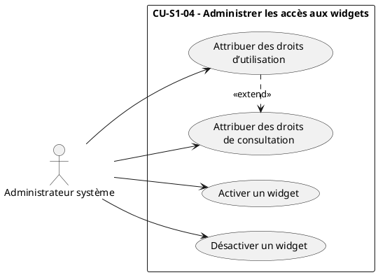

Ce diagramme présente le cas global choisi pour le Sprint 1 et ses sous-cas opérationnels. Il montre que l’administration d’un widget ne se limite pas à son état actif ou inactif : elle inclut également la séparation entre visibilité et exploitation.

### Diagramme de séquence — CU-S1-04.1 Activer un widget

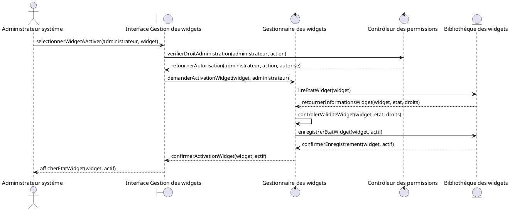

Ce diagramme montre que l’activation repose sur un contrôle préalable des droits et de la cohérence du widget avant sa mise à disposition.

### Diagramme de séquence — CU-S1-04.2 Désactiver un widget

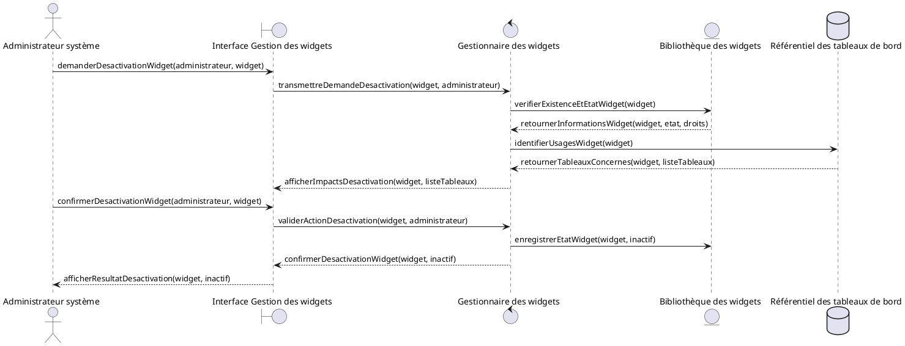

Ce diagramme met en évidence la prise en compte des usages existants avant de retirer un widget de la bibliothèque active.

### Diagramme de séquence — CU-S1-04.3 Attribuer des droits de consultation

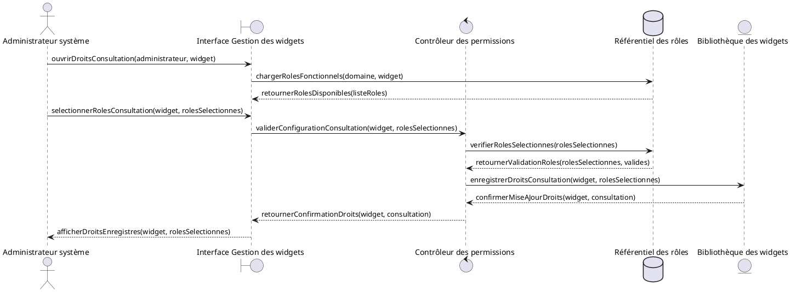

Ce diagramme décrit le contrôle de visibilité du widget. Les rôles ERPNext/Frappe servent de base à l’attribution des droits de consultation.

### Diagramme de séquence — CU-S1-04.4 Attribuer des droits d’utilisation

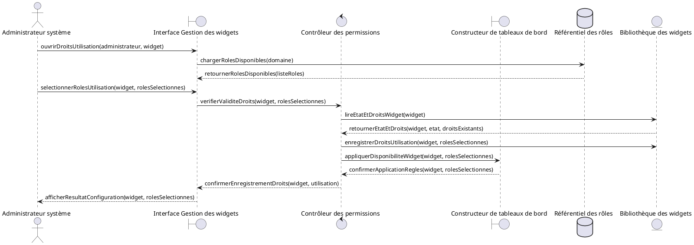

Ce diagramme distingue l’accès visuel au widget de son exploitation effective dans le constructeur et les vues décisionnelles.

### Diagramme de classes conceptuel du Sprint 1

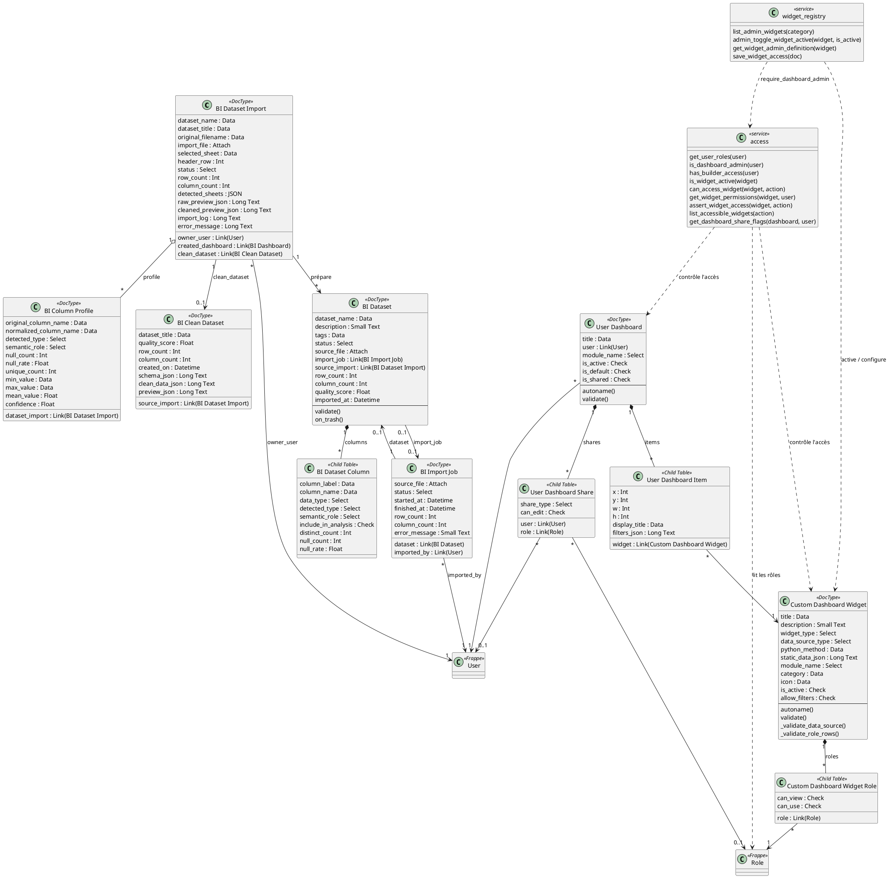

Ce diagramme couvre l’ensemble des fonctionnalités du Sprint 1 : importation, prévisualisation, constitution des jeux de données, administration des widgets et administration des tableaux de bord. Il montre également que les droits d’accès sont rattachés aux rôles fonctionnels ERPNext/Frappe afin de sécuriser les consultations et les usages futurs.

### Schéma relationnel de la base de données — Sprint 1

Le schéma ci-dessous présente les relations issues du diagramme de classes du Sprint 1 en notation textuelle. Les clés primaires sont soulignées (notation `_attribut_`), les clés étrangères sont précédées du symbole `#`.

```
Importation(_id_importation_, nom, titre, nom_fichier, lien_fichier,
  feuillets_detectes, statut, nombre_lignes, nombre_colonnes,
  feuille_selectionnee, ligne_entete,
  apercu_brut, apercu_nettoye, journal_importation, message_erreur,
  #id_utilisateur, #id_tableau_de_bord, #id_jeu_nettoye)

TacheImportation(_id_tache_, fichier_source, statut, date_debut, date_fin,
  nombre_lignes, nombre_colonnes, message_erreur,
  #id_utilisateur)

ProfilColonne(_id_profil_, nom_colonne_original, nom_colonne_normalise,
  type_detecte, role_semantique, nb_valeurs_nulles, taux_valeurs_nulles,
  nb_valeurs_distinctes, valeur_min, valeur_max, valeur_moyenne, indice_confiance,
  #id_importation)

JeuDonneesNettoye(_id_jeu_nettoye_, titre, score_qualite, nombre_lignes,
  nombre_colonnes, date_creation, schema, donnees, apercu,
  #id_importation)

JeuDeDonnees(_id_jeu_, nom, description, etiquettes, statut, fichier_source,
  nombre_lignes, nombre_colonnes, score_qualite, date_importation,
  #id_tache_importation, #id_importation)

ColonneJeuDonnees(_id_colonne_, libelle, nom_technique, type_donnee,
  type_detecte, role_semantique, inclus_dans_analyse,
  nb_valeurs_distinctes, nb_valeurs_nulles, taux_valeurs_nulles,
  #id_jeu)

Widget(_id_widget_, titre, description, type_widget, type_source_donnees,
  methode_calcul, donnees_statiques, module, categorie, icone,
  est_actif, autorise_filtres)

PermissionWidget(_#id_widget_, _#id_role_, peut_consulter, peut_utiliser)

TableauDeBord(_id_tableau_, titre, module, est_actif, est_par_defaut, est_partage,
  #id_utilisateur)

ElementTableauDeBord(_id_element_, position_x, position_y, largeur, hauteur,
  titre_affiche, filtres,
  #id_tableau, #id_widget)

PartageTableauDeBord(_id_partage_, type_partage, peut_modifier,
  #id_tableau, #id_utilisateur, #id_role)
```

# Sprint 2 — Visualisation et supervision

## Objectif du sprint

Le deuxième sprint vise à transformer les données disponibles en représentations visuelles exploitables. Il porte sur la gestion des widgets, leur consultation et le développement du constructeur permettant au gestionnaire des tableaux de bord de composer des vues décisionnelles adaptées aux besoins métiers.

Durée prévue : 21 jours.

## Périmètre fonctionnel

- Gestion du catalogue fonctionnel des widgets.
- Consultation et exécution des widgets autorisés.
- Construction de tableaux de bord personnalisés.
- Organisation visuelle des widgets dans une vue décisionnelle.
- Modification, sauvegarde et consultation des tableaux de bord.
- Respect des droits définis lors du sprint précédent.

## Liste des cas d’utilisation

| Code du cas d’utilisation | Nom du cas d’utilisation | Acteur principal | Objectif | Priorité |
|---|---|---|---|---|
| CU-S2-01 | Gérer le catalogue des widgets | Gestionnaire des tableaux de bord | Maintenir les widgets disponibles pour la visualisation décisionnelle. | Haute |
| CU-S2-02 | Consulter et exécuter un widget | Responsable métier | Obtenir un indicateur ou une visualisation à partir des données autorisées. | Haute |
| CU-S2-03 | Construire un tableau de bord | Gestionnaire des tableaux de bord | Composer une vue décisionnelle à partir de widgets disponibles. | Haute |
| CU-S2-04 | Modifier la structure d’un tableau de bord | Gestionnaire des tableaux de bord | Ajuster la disposition, les titres et les paramètres visuels d’un tableau de bord. | Moyenne |
| CU-S2-05 | Consulter un tableau de bord décisionnel | Responsable métier | Analyser des indicateurs consolidés dans une interface unique. | Haute |

## Découpage détaillé des cas d’utilisation globaux

| Cas d’utilisation global | Besoin détaillé | Priorité | Phase | Charge estimée |
|---|---|---:|---|---:|
| 2.1 En tant que gestionnaire des tableaux de bord, je veux gérer le catalogue des widgets afin de disposer de composants visuels réutilisables. | 2.1.1 En tant que gestionnaire des tableaux de bord, je veux consulter la bibliothèque des widgets afin d’identifier les composants disponibles. | 3 | Conception | 1 |
|  | 2.1.2 En tant que gestionnaire des tableaux de bord, je veux modifier les informations descriptives d’un widget afin d’améliorer sa compréhension métier. | 3 | Développement | 1 |
|  | 2.1.3 En tant que gestionnaire des tableaux de bord, je veux classer les widgets par domaine afin de faciliter leur recherche. | 3 | Développement | 1 |
|  | 2.1.4 En tant que gestionnaire des tableaux de bord, je veux vérifier l’état d’un widget afin de m’assurer qu’il peut être utilisé dans les tableaux de bord. | 3 | Test | 1 |
| 2.2 En tant que responsable métier, je veux consulter et exécuter un widget afin d’obtenir un indicateur exploitable. | 2.2.1 En tant que responsable métier, je veux afficher un widget autorisé afin de consulter l’information correspondant à mon domaine. | 3 | Conception | 1 |
|  | 2.2.2 En tant que responsable métier, je veux appliquer des filtres au widget afin d’adapter l’indicateur à mon besoin d’analyse. | 3 | Développement | 1 |
|  | 2.2.3 En tant que responsable métier, je veux visualiser le résultat sous une forme adaptée afin de faciliter l’interprétation. | 3 | Développement | 1 |
|  | 2.2.4 En tant que responsable métier, je veux être informé lorsqu’un widget ne peut pas être affiché afin de comprendre l’origine du blocage. | 3 | Test | 1 |
| 2.3 En tant que gestionnaire des tableaux de bord, je veux construire un tableau de bord afin de regrouper les indicateurs utiles à un besoin métier. | 2.3.1 En tant que gestionnaire des tableaux de bord, je veux créer un nouveau tableau de bord afin de définir une vue décisionnelle. | 3 | Conception | 1 |
|  | 2.3.2 En tant que gestionnaire des tableaux de bord, je veux sélectionner des widgets disponibles afin de composer le contenu du tableau de bord. | 3 | Développement | 1 |
|  | 2.3.3 En tant que gestionnaire des tableaux de bord, je veux positionner les widgets afin d’organiser la lecture des indicateurs. | 3 | Développement | 2 |
|  | 2.3.4 En tant que gestionnaire des tableaux de bord, je veux personnaliser les titres affichés afin d’adapter la présentation au vocabulaire métier. | 3 | Développement | 1 |
|  | 2.3.5 En tant que gestionnaire des tableaux de bord, je veux sauvegarder le tableau de bord afin de le rendre consultable par les profils autorisés. | 3 | Test | 1 |
| 2.4 En tant que gestionnaire des tableaux de bord, je veux modifier la structure d’un tableau de bord afin de l’adapter à l’évolution des besoins. | 2.4.1 En tant que gestionnaire des tableaux de bord, je veux ouvrir un tableau de bord existant afin d’en modifier la composition. | 2 | Conception | 1 |
|  | 2.4.2 En tant que gestionnaire des tableaux de bord, je veux ajouter ou retirer des widgets afin d’ajuster les indicateurs suivis. | 2 | Développement | 1 |
|  | 2.4.3 En tant que gestionnaire des tableaux de bord, je veux réorganiser les widgets afin d’améliorer la lisibilité du tableau de bord. | 2 | Développement | 1 |
|  | 2.4.4 En tant que gestionnaire des tableaux de bord, je veux enregistrer les modifications afin de conserver la nouvelle structure. | 2 | Test | 1 |
| 2.5 En tant que responsable métier, je veux consulter un tableau de bord décisionnel afin d’analyser les performances de mon domaine. | 2.5.1 En tant que responsable métier, je veux afficher les tableaux de bord disponibles afin de choisir la vue pertinente. | 3 | Conception | 1 |
|  | 2.5.2 En tant que responsable métier, je veux charger les widgets autorisés du tableau de bord afin d’obtenir une vision consolidée. | 3 | Développement | 1 |
|  | 2.5.3 En tant que responsable métier, je veux analyser les indicateurs affichés afin d’appuyer ma prise de décision. | 3 | Test | 1 |

## Descriptions détaillées des sous-cas d’utilisation

Le cas d’utilisation global retenu pour le Sprint 2 est **CU-S2-03 — Construire un tableau de bord**. Les descriptions détaillées portent sur les sous-cas qui composent la construction progressive d’une vue décisionnelle.

### CU-S2-03.1 — Créer un nouveau tableau de bord

| Élément | Description |
|---|---|
| Code | CU-S2-03.1 |
| Nom | Créer un nouveau tableau de bord |
| Acteur principal | Gestionnaire des tableaux de bord |
| Acteurs secondaires | Système ERPNext/Frappe, constructeur de tableaux de bord, référentiel des tableaux de bord |
| Description | Ce sous-cas décrit l’initialisation d’un nouveau tableau de bord. Le gestionnaire définit une vue décisionnelle en renseignant les informations nécessaires à son identification, avant d’y intégrer des widgets. |
| Objectif | Créer le support fonctionnel qui recevra les indicateurs et visualisations adaptés à un besoin métier. |
| Préconditions | - Le gestionnaire est authentifié.<br>- Il possède le rôle recommandé pour créer des tableaux de bord.<br>- Les règles générales d’accès aux tableaux de bord sont définies.<br>- Le module de visualisation est disponible. |
| Postconditions | - Un tableau de bord est initialisé.<br>- Il possède un titre ou une identification fonctionnelle.<br>- Il peut recevoir des widgets dans le constructeur. |
| Scénario nominal | 1. Le gestionnaire ouvre le constructeur de tableaux de bord.<br>2. Il choisit l’action de création d’un nouveau tableau de bord.<br>3. Le système affiche un espace de configuration initiale.<br>4. Le gestionnaire renseigne les informations fonctionnelles nécessaires, notamment le titre et le domaine concerné lorsque cela est pertinent.<br>5. Le système vérifie que les informations obligatoires sont présentes.<br>6. Le système initialise la structure du tableau de bord.<br>7. Le système affiche l’espace de composition prêt à recevoir des widgets. |
| Scénarios alternatifs | - Le gestionnaire peut créer une vue destinée à un domaine métier précis.<br>- Le système peut proposer des valeurs par défaut pour accélérer l’initialisation.<br>- Le gestionnaire peut interrompre la création avant toute sauvegarde. |
| Exceptions | - Si le titre est absent ou invalide, la création est refusée.<br>- Si le gestionnaire ne possède pas le droit de création, l’accès au constructeur est bloqué.<br>- Si le système ne peut pas initialiser la structure, un message d’erreur est affiché. |
| Résultat attendu | Un nouveau tableau de bord est créé à l’état initial et peut être enrichi par l’ajout de widgets. |

### CU-S2-03.2 — Sélectionner des widgets disponibles

| Élément | Description |
|---|---|
| Code | CU-S2-03.2 |
| Nom | Sélectionner des widgets disponibles |
| Acteur principal | Gestionnaire des tableaux de bord |
| Acteurs secondaires | Système ERPNext/Frappe, catalogue des widgets, composant de contrôle des permissions |
| Description | Ce sous-cas décrit le choix des widgets à intégrer dans le tableau de bord. Le système affiche uniquement les widgets actifs et utilisables selon les droits du gestionnaire. |
| Objectif | Composer le contenu du tableau de bord à partir de composants visuels autorisés et pertinents. |
| Préconditions | - Un tableau de bord est en cours de création.<br>- Le gestionnaire est authentifié.<br>- Des widgets actifs existent dans le catalogue.<br>- Les droits d’utilisation des widgets ont été définis. |
| Postconditions | - Les widgets sélectionnés sont associés temporairement ou définitivement au tableau de bord en construction.<br>- Les widgets non autorisés ne sont pas intégrés.<br>- Le contenu du tableau de bord commence à prendre forme. |
| Scénario nominal | 1. Le gestionnaire consulte la bibliothèque des widgets depuis le constructeur.<br>2. Le système filtre les widgets selon leur état et les droits du gestionnaire.<br>3. Le système affiche la liste des widgets disponibles.<br>4. Le gestionnaire sélectionne les widgets correspondant au besoin métier.<br>5. Le système vérifie que chaque widget sélectionné reste actif et autorisé.<br>6. Les widgets sélectionnés sont ajoutés à la zone de composition.<br>7. Le système affiche les éléments ajoutés dans le tableau de bord en construction. |
| Scénarios alternatifs | - Le gestionnaire peut filtrer les widgets par domaine fonctionnel.<br>- Il peut retirer un widget sélectionné avant la sauvegarde.<br>- Il peut différer l’ajout de certains widgets si leur pertinence n’est pas confirmée. |
| Exceptions | - Si aucun widget n’est disponible, le système informe le gestionnaire.<br>- Si un widget devient inactif pendant la sélection, il n’est pas ajouté.<br>- Si le gestionnaire ne dispose pas du droit d’utilisation, le widget est masqué ou refusé. |
| Résultat attendu | Les widgets utiles et autorisés sont sélectionnés pour composer la vue décisionnelle. |

### CU-S2-03.3 — Positionner les widgets

| Élément | Description |
|---|---|
| Code | CU-S2-03.3 |
| Nom | Positionner les widgets |
| Acteur principal | Gestionnaire des tableaux de bord |
| Acteurs secondaires | Système ERPNext/Frappe, constructeur de tableaux de bord, composant de disposition |
| Description | Ce sous-cas décrit l’organisation visuelle des widgets dans le tableau de bord. Le gestionnaire positionne les composants afin de faciliter la lecture des indicateurs et la compréhension globale de la vue. |
| Objectif | Structurer l’affichage des indicateurs selon une logique de lecture claire et adaptée au besoin métier. |
| Préconditions | - Un tableau de bord est ouvert dans le constructeur.<br>- Au moins un widget a été sélectionné.<br>- Le gestionnaire dispose du droit de modification.<br>- L’espace de composition est disponible. |
| Postconditions | - Les widgets possèdent une position dans la vue.<br>- L’organisation visuelle du tableau de bord est définie.<br>- La structure peut être sauvegardée. |
| Scénario nominal | 1. Le gestionnaire visualise les widgets ajoutés au tableau de bord.<br>2. Il déplace les widgets dans l’espace de composition.<br>3. Le système met à jour la position visuelle de chaque widget.<br>4. Le gestionnaire ajuste l’ordre de lecture des indicateurs.<br>5. Le système vérifie que la disposition reste cohérente et lisible.<br>6. Le gestionnaire confirme la disposition retenue.<br>7. Le système conserve la structure en attente de sauvegarde. |
| Scénarios alternatifs | - Le gestionnaire peut agrandir ou réduire l’espace occupé par un widget si la vue le permet.<br>- Il peut réorganiser plusieurs widgets afin de regrouper les indicateurs d’un même domaine.<br>- Il peut revenir à une disposition précédente avant l’enregistrement final. |
| Exceptions | - Si la disposition est incohérente, le système empêche la validation.<br>- Si un widget est retiré pendant l’organisation, sa position est supprimée.<br>- Si le gestionnaire perd son droit d’édition, les modifications ne sont pas enregistrées. |
| Résultat attendu | Les widgets sont organisés dans une disposition claire, cohérente et prête à être sauvegardée. |

### CU-S2-03.4 — Personnaliser les titres affichés

| Élément | Description |
|---|---|
| Code | CU-S2-03.4 |
| Nom | Personnaliser les titres affichés |
| Acteur principal | Gestionnaire des tableaux de bord |
| Acteurs secondaires | Système ERPNext/Frappe, constructeur de tableaux de bord, composant de présentation |
| Description | Ce sous-cas décrit l’adaptation des titres visibles dans le tableau de bord. Le gestionnaire peut utiliser un vocabulaire métier plus compréhensible pour les utilisateurs destinataires, sans modifier la nature fonctionnelle du widget. |
| Objectif | Améliorer la lisibilité du tableau de bord en adaptant les libellés affichés au contexte métier. |
| Préconditions | - Un tableau de bord est en cours de construction.<br>- Des widgets ont été ajoutés à la vue.<br>- Le gestionnaire possède le droit de modification.<br>- Les titres saisis respectent les règles de présentation. |
| Postconditions | - Les titres affichés sont mis à jour dans la configuration du tableau de bord.<br>- Les utilisateurs consultent des libellés adaptés au contexte métier.<br>- La personnalisation peut être sauvegardée avec la structure. |
| Scénario nominal | 1. Le gestionnaire sélectionne un widget dans la zone de composition.<br>2. Le système affiche les paramètres de présentation disponibles.<br>3. Le gestionnaire modifie le titre visible du widget.<br>4. Le système vérifie que le titre n’est pas vide et reste exploitable.<br>5. Le système met à jour l’aperçu du tableau de bord.<br>6. Le gestionnaire répète l’opération pour les widgets concernés.<br>7. Les titres personnalisés sont conservés en attente de sauvegarde. |
| Scénarios alternatifs | - Le gestionnaire peut conserver le titre par défaut d’un widget.<br>- Il peut revenir au titre initial si la personnalisation n’est pas satisfaisante.<br>- Il peut harmoniser les titres de plusieurs widgets pour améliorer la cohérence de lecture. |
| Exceptions | - Si le titre est vide, le système refuse la modification.<br>- Si le titre est trop ambigu, le système peut demander une correction selon les règles de qualité prévues.<br>- Si la modification n’est pas autorisée, le système conserve le titre existant. |
| Résultat attendu | Les widgets affichent des titres clairs et adaptés aux utilisateurs qui consulteront le tableau de bord. |

### CU-S2-03.5 — Sauvegarder le tableau de bord

| Élément | Description |
|---|---|
| Code | CU-S2-03.5 |
| Nom | Sauvegarder le tableau de bord |
| Acteur principal | Gestionnaire des tableaux de bord |
| Acteurs secondaires | Système ERPNext/Frappe, constructeur de tableaux de bord, référentiel des tableaux de bord |
| Description | Ce sous-cas décrit l’enregistrement de la configuration finale du tableau de bord. La sauvegarde rend persistants le titre, la structure, les widgets sélectionnés, leur position et les éléments de présentation. |
| Objectif | Conserver le tableau de bord afin qu’il puisse être consulté ou modifié ultérieurement par les profils autorisés. |
| Préconditions | - Le tableau de bord possède une identification valide.<br>- Au moins un widget autorisé est présent ou la politique fonctionnelle autorise une sauvegarde incomplète.<br>- Le gestionnaire dispose du droit de sauvegarde.<br>- La disposition ne contient pas d’incohérence bloquante. |
| Postconditions | - Le tableau de bord est enregistré dans le système.<br>- Sa structure devient disponible pour les consultations futures.<br>- Les règles d’accès configurées s’appliquent lors de son affichage. |
| Scénario nominal | 1. Le gestionnaire vérifie la composition finale du tableau de bord.<br>2. Il demande la sauvegarde de la vue décisionnelle.<br>3. Le système contrôle l’identification du tableau de bord, les widgets associés et la disposition.<br>4. Le système vérifie les droits du gestionnaire.<br>5. Le système enregistre la configuration dans le référentiel des tableaux de bord.<br>6. Le système confirme la sauvegarde.<br>7. Le tableau de bord devient disponible selon les droits définis. |
| Scénarios alternatifs | - Le gestionnaire peut sauvegarder une version provisoire si le système l’autorise.<br>- Il peut revenir au constructeur après sauvegarde pour effectuer des ajustements.<br>- Le tableau de bord peut rester non visible aux responsables métiers tant que les accès ne sont pas accordés. |
| Exceptions | - Si la configuration est incomplète, la sauvegarde est refusée.<br>- Si un widget n’est plus autorisé, le système demande son retrait ou une correction.<br>- Si le gestionnaire ne possède pas les droits requis, l’enregistrement est bloqué.<br>- Si une erreur d’enregistrement survient, le système conserve l’état précédent. |
| Résultat attendu | Le tableau de bord est sauvegardé avec sa composition et sa disposition, puis devient exploitable selon les droits prévus. |

## Conception du sprint

### Diagramme de cas d’utilisation du cas global retenu

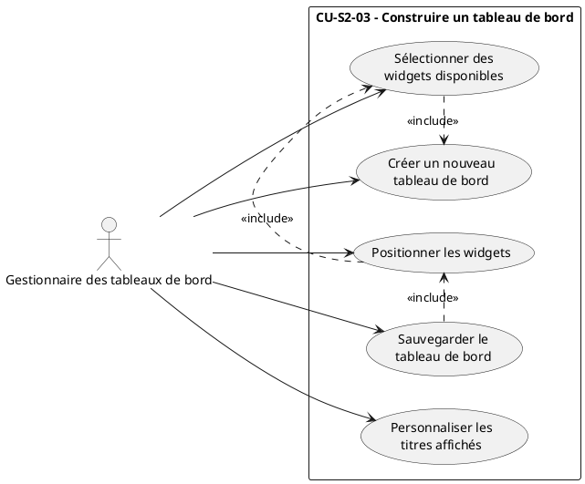

Ce diagramme présente la construction d’un tableau de bord comme une succession de sous-cas complémentaires, depuis l’initialisation jusqu’à l’enregistrement de la configuration.

### Diagramme de séquence — CU-S2-03.1 Créer un nouveau tableau de bord

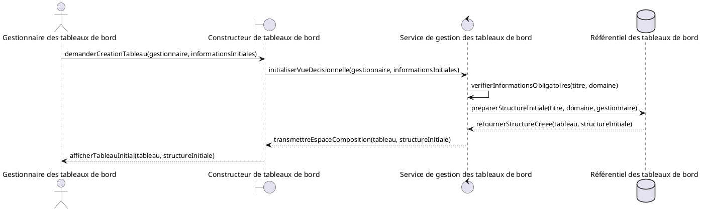

Ce diagramme montre l’initialisation fonctionnelle d’une vue décisionnelle avant l’ajout de widgets.

### Diagramme de séquence — CU-S2-03.2 Sélectionner des widgets disponibles

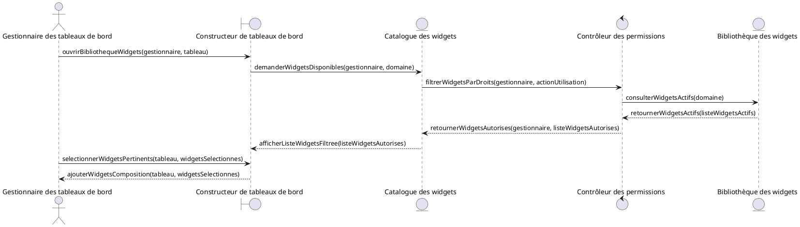

Ce diagramme illustre le lien direct entre les droits définis au Sprint 1 et la sélection des widgets dans le constructeur.

### Diagramme de séquence — CU-S2-03.3 Positionner les widgets

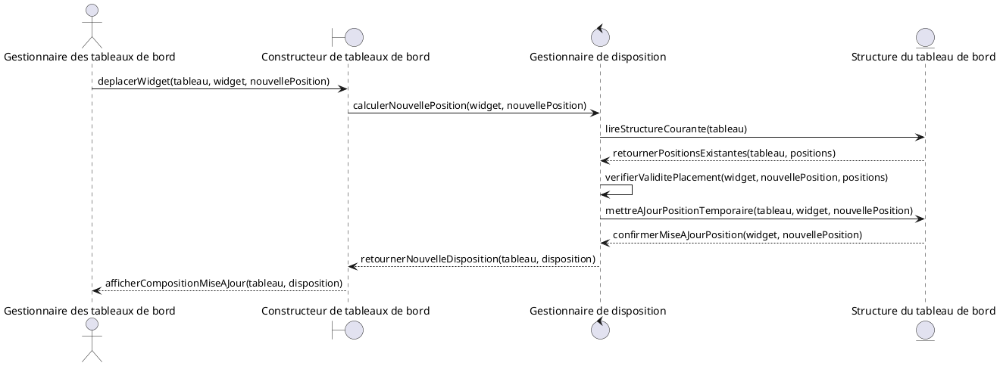

Ce diagramme montre que le positionnement est contrôlé par une logique de disposition afin de préserver une vue lisible et exploitable.

### Diagramme de séquence — CU-S2-03.4 Personnaliser les titres affichés

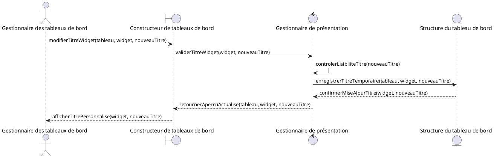

Ce diagramme met en évidence la personnalisation des libellés comme une action de présentation, distincte du fonctionnement métier du widget.

### Diagramme de séquence — CU-S2-03.5 Sauvegarder le tableau de bord

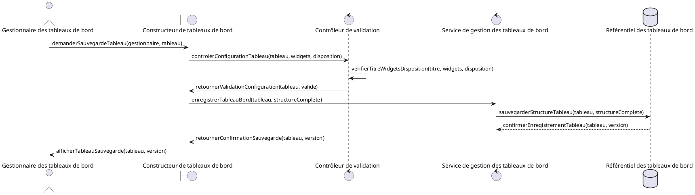

Ce diagramme formalise la sauvegarde comme une étape de validation puis de persistance de la configuration.

### Diagramme de classes conceptuel du Sprint 2

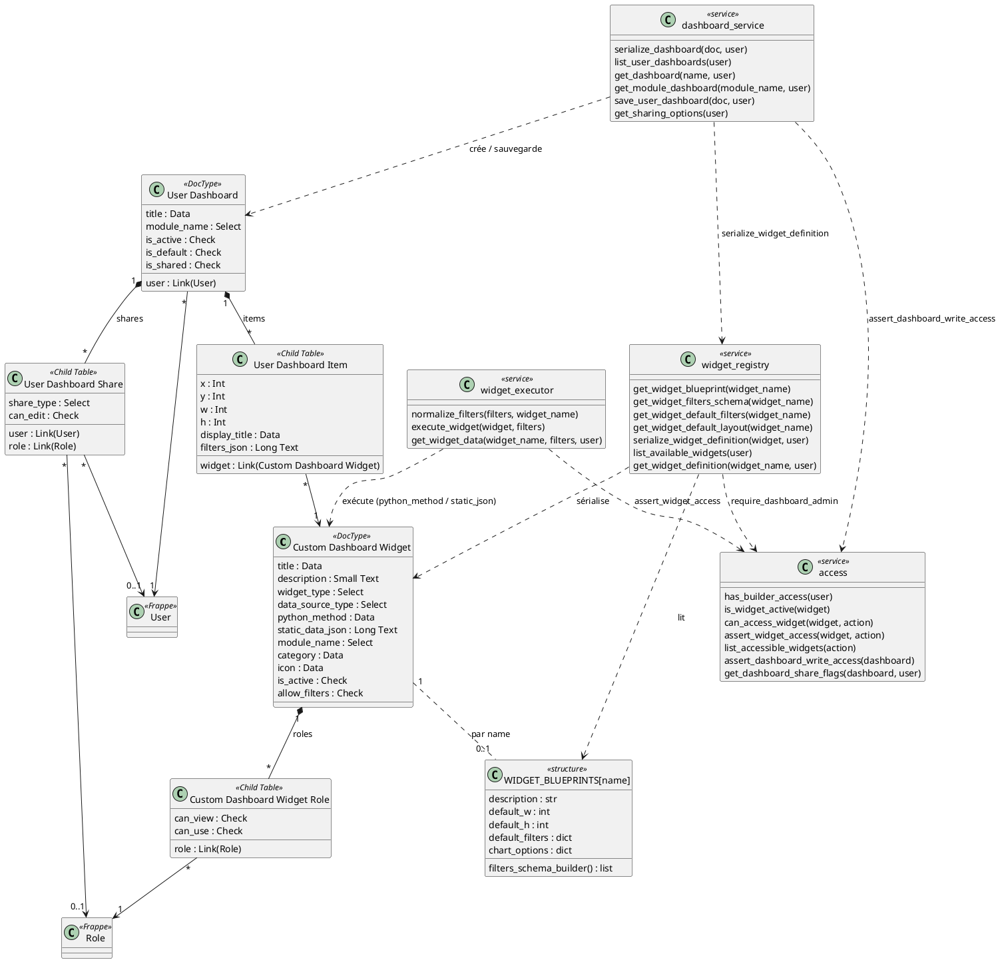

Ce diagramme couvre tout le Sprint 2 : gestion du catalogue, consultation et exécution des widgets, construction des tableaux de bord, organisation visuelle, personnalisation et consultation par les responsables métiers. Les droits d’accès hérités du Sprint 1 restent présents afin de montrer que la visualisation dépend toujours des permissions fonctionnelles.

### Schéma relationnel de la base de données — Sprint 2

Le schéma ci-dessous présente les relations issues du diagramme de classes du Sprint 2. Les structures de calcul et les catalogues de définition des widgets n’étant pas persistés en base, seules les entités stockées figurent dans ce schéma.

```
Widget(_id_widget_, titre, description, type_widget, type_source_donnees,
  methode_calcul, donnees_statiques, module, categorie, icone,
  est_actif, autorise_filtres)

PermissionWidget(_#id_widget_, _#id_role_, peut_consulter, peut_utiliser)

TableauDeBord(_id_tableau_, titre, module, est_actif, est_par_defaut, est_partage,
  #id_utilisateur)

ElementTableauDeBord(_id_element_, position_x, position_y, largeur, hauteur,
  titre_affiche, filtres,
  #id_tableau, #id_widget)

PartageTableauDeBord(_id_partage_, type_partage, peut_modifier,
  #id_tableau, #id_utilisateur, #id_role)
```

# Sprint 3 — Intelligence artificielle et analyse avancée

## Objectif du sprint

Le troisième sprint vise à intégrer des fonctions d’analyse avancée et d’assistance intelligente au système d’aide à la décision. Il couvre la génération d’analyses, l’interrogation de l’assistant IA, la gestion des conversations, la conservation de l’historique et le recueil de retours sur les réponses produites.

Durée prévue : 21 jours.

## Périmètre fonctionnel

- Génération ou consultation d’analyses assistées.
- Interprétation d’indicateurs, de tendances et de recommandations.
- Développement de l’assistant IA décisionnel.
- Gestion des conversations entre l’utilisateur et l’assistant.
- Conservation de l’historique conversationnel.
- Évaluation des réponses produites par l’Agent IA.
- Respect des droits ERPNext/Frappe lors de l’accès aux données analysées.

## Liste des cas d’utilisation

| Code du cas d’utilisation | Nom du cas d’utilisation | Acteur principal | Objectif | Priorité |
|---|---|---|---|---|
| CU-S3-01 | Générer une analyse assistée | Responsable métier | Obtenir une interprétation synthétique ou avancée des indicateurs. | Haute |
| CU-S3-02 | Consulter et gérer une analyse | Responsable métier | Accéder aux analyses produites et maintenir leur cycle de vie. | Moyenne |
| CU-S3-03 | Interroger l’assistant IA | Responsable métier | Poser une question métier et obtenir une réponse contextualisée. | Haute |
| CU-S3-04 | Gérer une conversation | Responsable métier | Créer, consulter, renommer ou supprimer une conversation. | Moyenne |
| CU-S3-05 | Évaluer une réponse de l’Agent IA | Responsable métier | Fournir un retour permettant d’apprécier la qualité de l’assistance. | Moyenne |

## Découpage détaillé des cas d’utilisation globaux

| Cas d’utilisation global | Besoin détaillé | Priorité | Phase | Charge estimée |
|---|---|---:|---|---:|
| 3.1 En tant que responsable métier, je veux générer une analyse assistée afin de mieux interpréter les indicateurs décisionnels. | 3.1.1 En tant que responsable métier, je veux demander une analyse à partir d’un tableau de bord afin d’obtenir une interprétation synthétique. | 3 | Conception | 1 |
|  | 3.1.2 En tant que responsable métier, je veux que le système prépare les indicateurs autorisés afin que l’analyse respecte mon périmètre d’accès. | 3 | Développement | 1 |
|  | 3.1.3 En tant que responsable métier, je veux obtenir une synthèse, des tendances et des recommandations afin d’appuyer ma décision. | 3 | Développement | 2 |
|  | 3.1.4 En tant que responsable métier, je veux consulter l’analyse produite afin de l’exploiter dans mon suivi métier. | 3 | Test | 1 |
| 3.2 En tant que responsable métier, je veux consulter et gérer les analyses afin de conserver les interprétations utiles. | 3.2.1 En tant que responsable métier, je veux lister les analyses disponibles afin de retrouver les interprétations déjà produites. | 2 | Conception | 1 |
|  | 3.2.2 En tant que responsable métier, je veux consulter le détail d’une analyse afin d’en examiner le résumé et les recommandations. | 2 | Développement | 1 |
|  | 3.2.3 En tant que responsable métier, je veux renommer une analyse afin de l’identifier plus facilement. | 2 | Développement | 1 |
|  | 3.2.4 En tant que responsable métier, je veux supprimer une analyse devenue inutile afin de maintenir un espace de travail clair. | 2 | Test | 1 |
| 3.3 En tant que responsable métier, je veux interroger l’assistant IA afin d’obtenir une réponse contextualisée à une question métier. | 3.3.1 En tant que responsable métier, je veux saisir une question en langage naturel afin de formuler simplement mon besoin. | 3 | Conception | 1 |
|  | 3.3.2 En tant que responsable métier, je veux que le système identifie le domaine de ma question afin d’utiliser les données pertinentes. | 3 | Développement | 1 |
|  | 3.3.3 En tant que responsable métier, je veux que mes droits soient vérifiés avant l’accès aux données afin de garantir la confidentialité. | 3 | Développement | 1 |
|  | 3.3.4 En tant que responsable métier, je veux recevoir une réponse claire de l’Agent IA afin de comprendre rapidement les informations demandées. | 3 | Développement | 2 |
|  | 3.3.5 En tant que responsable métier, je veux que la réponse soit conservée dans la conversation afin de pouvoir la retrouver ultérieurement. | 3 | Test | 1 |
| 3.4 En tant que responsable métier, je veux gérer mes conversations afin de conserver l’historique de mes échanges avec l’assistant IA. | 3.4.1 En tant que responsable métier, je veux créer une conversation afin de démarrer un nouvel échange. | 2 | Conception | 1 |
|  | 3.4.2 En tant que responsable métier, je veux consulter l’historique d’une conversation afin de reprendre une analyse. | 2 | Développement | 1 |
|  | 3.4.3 En tant que responsable métier, je veux renommer une conversation afin de la retrouver facilement. | 2 | Développement | 1 |
|  | 3.4.4 En tant que responsable métier, je veux supprimer une conversation devenue inutile afin d’organiser mon espace d’assistance. | 2 | Test | 1 |
| 3.5 En tant que responsable métier, je veux évaluer une réponse de l’Agent IA afin de contribuer au suivi de la qualité de l’assistance. | 3.5.1 En tant que responsable métier, je veux indiquer si une réponse est utile afin de qualifier la pertinence de l’assistance. | 2 | Développement | 1 |
|  | 3.5.2 En tant que responsable métier, je veux ajouter un commentaire ou une réponse attendue afin de préciser les limites de la réponse reçue. | 2 | Test | 1 |

## Descriptions détaillées des sous-cas d’utilisation

Le cas d’utilisation global retenu pour le Sprint 3 est **CU-S3-03 — Interroger l’assistant IA**. Les descriptions détaillées portent sur les sous-cas constituant l’échange entre le responsable métier, le système ERPNext/Frappe et l’Agent IA, qui reste un composant intelligent d’assistance.

### CU-S3-03.1 — Saisir une question en langage naturel

| Élément | Description |
|---|---|
| Code | CU-S3-03.1 |
| Nom | Saisir une question en langage naturel |
| Acteur principal | Responsable métier |
| Acteurs secondaires | Système ERPNext/Frappe, interface de conversation |
| Description | Ce sous-cas décrit la formulation d’une question métier par le responsable métier dans un langage naturel. L’utilisateur exprime son besoin sans manipuler directement les sources de données ou les paramètres techniques du système. |
| Objectif | Permettre à l’utilisateur métier de formuler simplement une demande d’analyse ou d’explication. |
| Préconditions | - Le responsable métier est authentifié.<br>- L’assistant IA est accessible depuis l’interface.<br>- Une conversation existe ou peut être créée.<br>- L’utilisateur dispose d’un rôle métier autorisé à utiliser l’assistant. |
| Postconditions | - La question est reçue par le système.<br>- Elle est associée à une conversation.<br>- Elle peut être analysée par les composants d’assistance. |
| Scénario nominal | 1. Le responsable métier ouvre l’interface de conversation.<br>2. Le système affiche la zone de saisie et l’historique disponible.<br>3. Le responsable métier rédige sa question en langage naturel.<br>4. Il valide l’envoi de la question.<br>5. Le système vérifie que la question n’est pas vide.<br>6. Le système associe la question à la conversation courante.<br>7. Le système transmet la question pour traitement fonctionnel. |
| Scénarios alternatifs | - Si aucune conversation n’existe, le système en crée une nouvelle au moment du premier message.<br>- L’utilisateur peut reformuler sa demande avant l’envoi.<br>- La question peut porter sur un tableau de bord, un indicateur ou une situation métier générale. |
| Exceptions | - Si l’utilisateur n’est pas authentifié, l’accès à l’assistant est refusé.<br>- Si la question est vide, le système demande une saisie valide.<br>- Si la conversation n’est pas accessible, la question n’est pas enregistrée. |
| Résultat attendu | La question du responsable métier est correctement enregistrée et prête à être interprétée par le système. |

### CU-S3-03.2 — Identifier le domaine de la question

| Élément | Description |
|---|---|
| Code | CU-S3-03.2 |
| Nom | Identifier le domaine de la question |
| Acteur principal | Responsable métier |
| Acteurs secondaires | Système ERPNext/Frappe, composant d’interprétation fonctionnelle, Agent IA |
| Description | Ce sous-cas décrit l’analyse initiale de la question afin de déterminer le domaine fonctionnel concerné, par exemple ventes, stocks, achats, comptabilité ou ressources humaines. Cette identification permet de préparer un contexte pertinent pour la réponse. |
| Objectif | Orienter le traitement de la question vers les informations métier pertinentes. |
| Préconditions | - Une question a été saisie.<br>- Le système dispose de règles ou de connaissances permettant d’identifier le domaine fonctionnel.<br>- Les domaines métier utilisés dans ERPNext/Frappe sont connus du système.<br>- L’Agent IA peut contribuer à l’interprétation si nécessaire. |
| Postconditions | - Le domaine fonctionnel probable est identifié.<br>- La question est contextualisée.<br>- Le système peut poursuivre le contrôle des droits sur le domaine concerné. |
| Scénario nominal | 1. Le système reçoit la question saisie par le responsable métier.<br>2. Il analyse les termes utilisés et le contexte de la conversation.<br>3. Le système recherche le domaine fonctionnel le plus probable.<br>4. Si nécessaire, l’Agent IA contribue à clarifier l’intention de la question.<br>5. Le système associe la question au domaine identifié.<br>6. Le système prépare les informations nécessaires au contrôle des permissions.<br>7. Le traitement se poursuit vers la vérification des droits d’accès. |
| Scénarios alternatifs | - Si plusieurs domaines sont possibles, le système peut retenir le plus probable ou demander une précision.<br>- Si la question est générale, le système peut la traiter sans rattachement à des données sensibles.<br>- Si le contexte de conversation suffit, le domaine peut être déduit de l’échange précédent. |
| Exceptions | - Si la question est incompréhensible, le système demande une reformulation.<br>- Si aucun domaine ne peut être identifié, le système limite la réponse à une aide générale.<br>- Si le domaine identifié ne correspond à aucun périmètre connu, le traitement métier est interrompu. |
| Résultat attendu | La question est associée à un domaine fonctionnel pertinent, ce qui permet de poursuivre le traitement de manière contextualisée. |

### CU-S3-03.3 — Vérifier les droits avant l’accès aux données

| Élément | Description |
|---|---|
| Code | CU-S3-03.3 |
| Nom | Vérifier les droits avant l’accès aux données |
| Acteur principal | Responsable métier |
| Acteurs secondaires | Système ERPNext/Frappe, composant de contrôle des permissions, référentiel des rôles |
| Description | Ce sous-cas décrit le contrôle des autorisations avant toute consultation de données. Le système vérifie que le responsable métier possède les droits nécessaires pour accéder au domaine ou aux indicateurs demandés. |
| Objectif | Garantir la confidentialité des données et empêcher l’Agent IA de recevoir un contexte non autorisé. |
| Préconditions | - La question est associée à un domaine fonctionnel.<br>- Le responsable métier est authentifié.<br>- Les rôles ERPNext/Frappe de l’utilisateur sont connus.<br>- Les règles d’accès aux données décisionnelles sont définies. |
| Postconditions | - L’accès aux données est autorisé ou refusé.<br>- Seules les informations autorisées peuvent être utilisées pour construire le contexte.<br>- En cas de refus, aucune donnée sensible n’est transmise à l’Agent IA. |
| Scénario nominal | 1. Le système identifie le profil du responsable métier connecté.<br>2. Il récupère les rôles ERPNext/Frappe associés à ce profil.<br>3. Le système compare ces rôles avec le domaine et les données demandés.<br>4. Le système détermine le périmètre exact des informations autorisées.<br>5. Si l’accès est permis, le système prépare la consultation des données.<br>6. Le système exclut les informations non autorisées du contexte.<br>7. Le traitement se poursuit vers la génération de la réponse. |
| Scénarios alternatifs | - Si l’utilisateur possède un accès partiel, le système limite le contexte aux données autorisées.<br>- Si la question ne nécessite pas de données métier, le système peut poursuivre sans consultation du référentiel décisionnel.<br>- Si le responsable métier appartient à plusieurs rôles, le système applique le périmètre correspondant aux règles définies. |
| Exceptions | - Si l’utilisateur n’a aucun droit sur le domaine demandé, le système refuse le traitement métier.<br>- Si les rôles ne peuvent pas être déterminés, l’accès aux données est bloqué.<br>- Si les règles de permission sont incohérentes, le système affiche un message d’indisponibilité fonctionnelle. |
| Résultat attendu | Les droits sont vérifiés avant toute exploitation des données, garantissant une réponse conforme au périmètre autorisé. |

### CU-S3-03.4 — Recevoir une réponse claire de l’Agent IA

| Élément | Description |
|---|---|
| Code | CU-S3-03.4 |
| Nom | Recevoir une réponse claire de l’Agent IA |
| Acteur principal | Responsable métier |
| Acteurs secondaires | Agent IA, système ERPNext/Frappe, composant de préparation du contexte |
| Description | Ce sous-cas décrit la production d’une réponse contextualisée par l’Agent IA. Le système lui transmet uniquement les informations autorisées et utiles à la question, puis présente la réponse au responsable métier sous une forme compréhensible. |
| Objectif | Fournir une explication ou une synthèse claire, adaptée au besoin métier exprimé par l’utilisateur. |
| Préconditions | - Une question valide a été saisie.<br>- Le domaine fonctionnel est identifié.<br>- Les droits d’accès ont été vérifiés.<br>- Le contexte autorisé est disponible. |
| Postconditions | - Une réponse est produite par l’Agent IA ou un message d’indisponibilité est affiché.<br>- La réponse respecte le périmètre de données autorisé.<br>- Le responsable métier peut exploiter l’information obtenue. |
| Scénario nominal | 1. Le système prépare un contexte limité aux données autorisées.<br>2. Il transmet la question et le contexte à l’Agent IA.<br>3. L’Agent IA interprète la demande dans le cadre fourni.<br>4. L’Agent IA formule une réponse claire, structurée et adaptée au domaine métier.<br>5. Le système reçoit la réponse produite.<br>6. Le système vérifie que la réponse peut être présentée à l’utilisateur.<br>7. Le système affiche la réponse au responsable métier. |
| Scénarios alternatifs | - Si le contexte est limité, l’Agent IA peut produire une réponse prudente et signaler les limites de l’analyse.<br>- Si la question est générale, la réponse peut ne pas s’appuyer sur des données métier.<br>- Si la réponse est longue, le système peut la présenter sous forme synthétique. |
| Exceptions | - Si l’Agent IA est indisponible, le système informe l’utilisateur.<br>- Si aucune donnée autorisée ne permet de répondre, le système indique la limite de traitement.<br>- Si la réponse ne peut pas être générée, le système invite l’utilisateur à reformuler sa question. |
| Résultat attendu | Le responsable métier reçoit une réponse intelligible, contextualisée et conforme aux droits d’accès. |

### CU-S3-03.5 — Conserver la réponse dans la conversation

| Élément | Description |
|---|---|
| Code | CU-S3-03.5 |
| Nom | Conserver la réponse dans la conversation |
| Acteur principal | Responsable métier |
| Acteurs secondaires | Système ERPNext/Frappe, référentiel des conversations, Agent IA |
| Description | Ce sous-cas décrit l’enregistrement de la réponse dans la conversation associée à la question. La conservation de l’échange permet à l’utilisateur de retrouver l’analyse, de poursuivre la discussion et de garder une trace des informations obtenues. |
| Objectif | Assurer la continuité et la traçabilité des échanges avec l’assistant IA. |
| Préconditions | - Une conversation est disponible.<br>- Une question a été enregistrée.<br>- Une réponse a été produite ou un message système doit être conservé.<br>- L’utilisateur est autorisé à accéder à la conversation. |
| Postconditions | - La réponse est associée à la conversation.<br>- L’historique est mis à jour.<br>- Le responsable métier peut consulter ultérieurement l’échange. |
| Scénario nominal | 1. Le système reçoit la réponse produite par l’Agent IA.<br>2. Le système identifie la conversation associée à la question initiale.<br>3. Il vérifie que la conversation appartient au responsable métier ou lui est accessible.<br>4. Le système enregistre la réponse dans l’historique.<br>5. Le système met à jour la date ou le résumé de la conversation si nécessaire.<br>6. Le système affiche la réponse dans le fil de conversation.<br>7. Le responsable métier peut poursuivre l’échange ou consulter la réponse ultérieurement. |
| Scénarios alternatifs | - Si la conversation vient d’être créée, la réponse devient le premier élément de réponse conservé.<br>- Si l’utilisateur poursuit l’échange, les messages suivants sont rattachés à la même conversation.<br>- Le système peut générer un titre de conversation à partir du contenu initial. |
| Exceptions | - Si la conversation est introuvable, le système ne peut pas enregistrer la réponse.<br>- Si l’utilisateur n’a plus accès à la conversation, l’enregistrement est refusé.<br>- Si une erreur de conservation survient, le système affiche la réponse mais signale que l’historique n’a pas été mis à jour. |
| Résultat attendu | La réponse de l’Agent IA est conservée dans la conversation et reste accessible pour un usage ultérieur. |

## Conception du sprint

### Diagramme de cas d’utilisation du cas global retenu

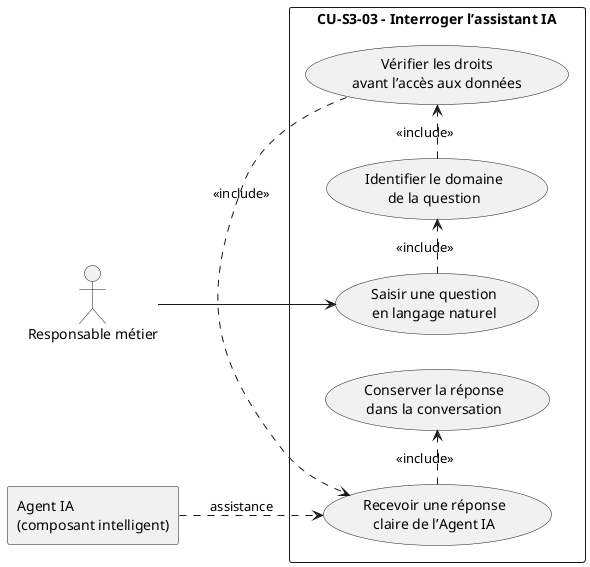

Ce diagramme distingue le responsable métier, qui est l’acteur humain principal, et l’Agent IA, représenté comme un composant intelligent intervenant uniquement dans la production de la réponse.

### Diagramme de séquence — CU-S3-03.1 Saisir une question en langage naturel

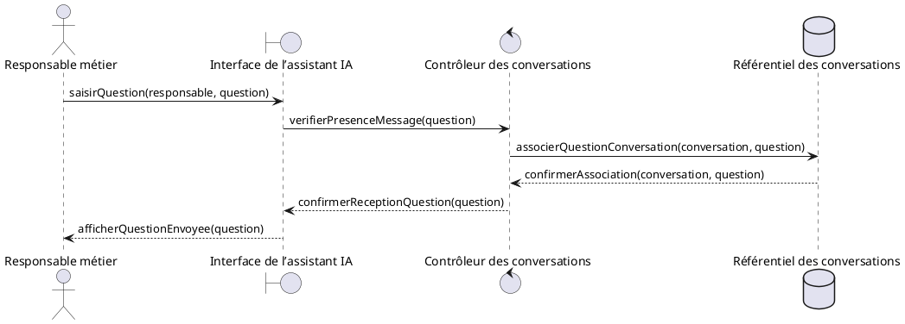

Ce diagramme montre la première étape de l’échange : la question est capturée, contrôlée et rattachée à une conversation.

### Diagramme de séquence — CU-S3-03.2 Identifier le domaine de la question

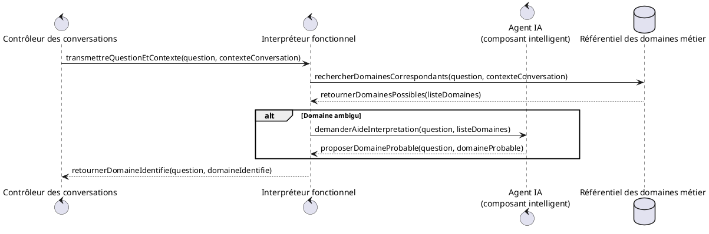

Ce diagramme présente l’identification du domaine comme une étape de contextualisation avant tout accès aux données.

### Diagramme de séquence — CU-S3-03.3 Vérifier les droits avant l’accès aux données

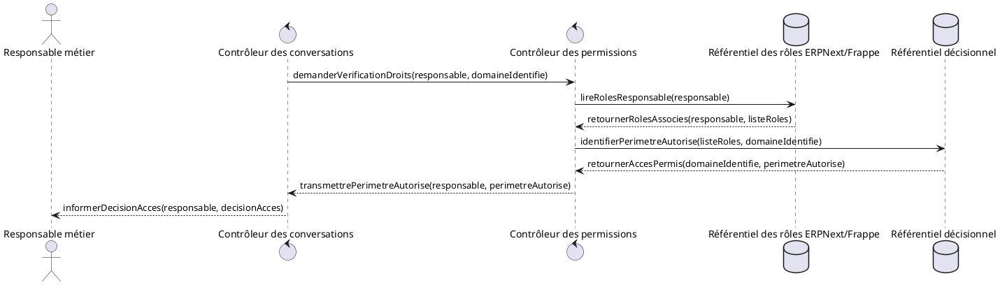

Ce diagramme insiste sur le fait que le contrôle d’accès précède toute construction du contexte transmis à l’Agent IA.

### Diagramme de séquence — CU-S3-03.4 Recevoir une réponse claire de l’Agent IA

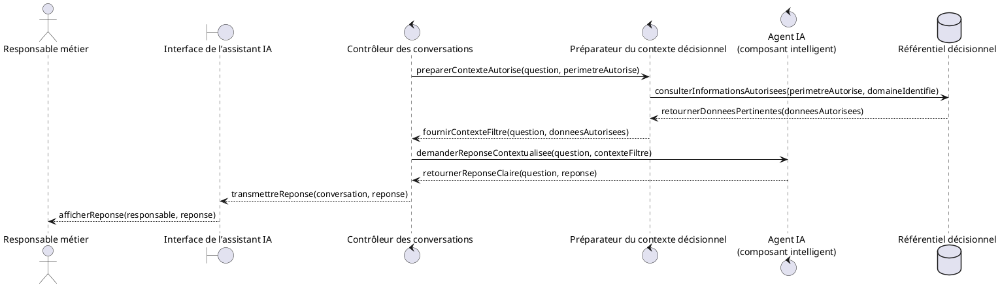

Ce diagramme montre que l’Agent IA n’intervient qu’après préparation d’un contexte limité aux informations autorisées.

### Diagramme de séquence — CU-S3-03.5 Conserver la réponse dans la conversation

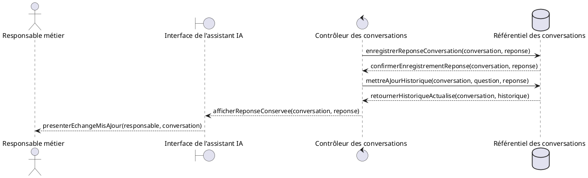

Ce diagramme représente la conservation de la réponse comme une étape de traçabilité permettant de reprendre l’échange ultérieurement.

### Diagramme de classes conceptuel du Sprint 3

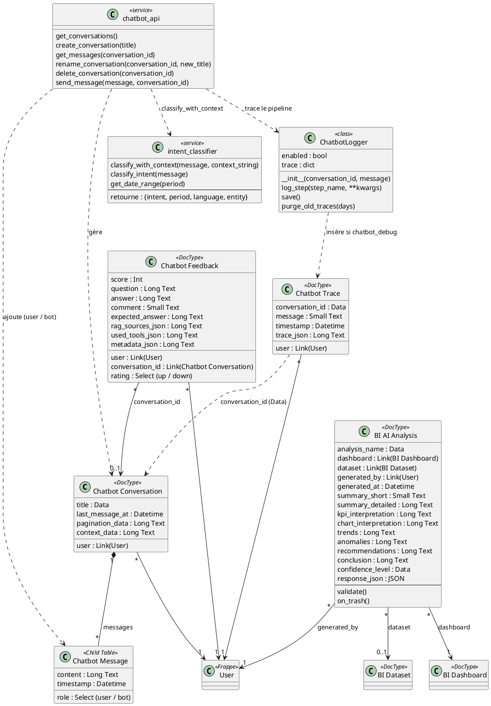

Ce diagramme couvre l’ensemble du Sprint 3 : génération des analyses assistées, interrogation de l’assistant IA, conservation des conversations, gestion des réponses et collecte des retours utilisateur. L’Agent IA reste représenté comme un composant intelligent d’assistance, tandis que le responsable métier demeure l’acteur humain principal.

### Schéma relationnel de la base de données — Sprint 3

Le schéma ci-dessous présente les relations issues du diagramme de classes du Sprint 3 pour la gestion des conversations, l'évaluation des réponses et la conservation des analyses assistées.

```
Conversation(_id_conversation_, titre, donnees_pagination, donnees_contexte,
  date_dernier_message,
  #id_utilisateur)

MessageConversation(_id_message_, role_emetteur, contenu, horodatage,
  #id_conversation)

RetourUtilisateur(_id_retour_, note, score, question, reponse,
  commentaire, reponse_attendue, sources_utilisees, outils_utilises, metadonnees,
  #id_utilisateur, #id_conversation)

TraceExecution(_id_trace_, message, horodatage, details_trace,
  #id_utilisateur, id_conversation)

AnalyseAssistee(_id_analyse_, nom, date_generation, resume_court, resume_detaille,
  interpretation_indicateurs, interpretation_graphiques, tendances,
  anomalies, recommandations, conclusion, niveau_confiance, donnees_reponse,
  #id_tableau_de_bord, #id_jeu_de_donnees, #id_utilisateur)
```
