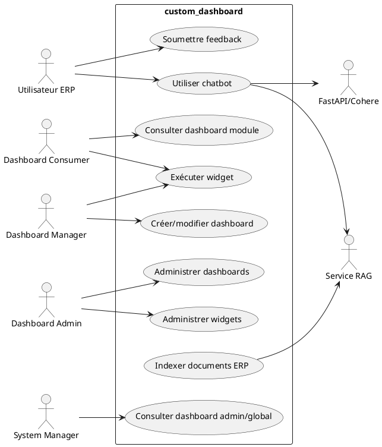
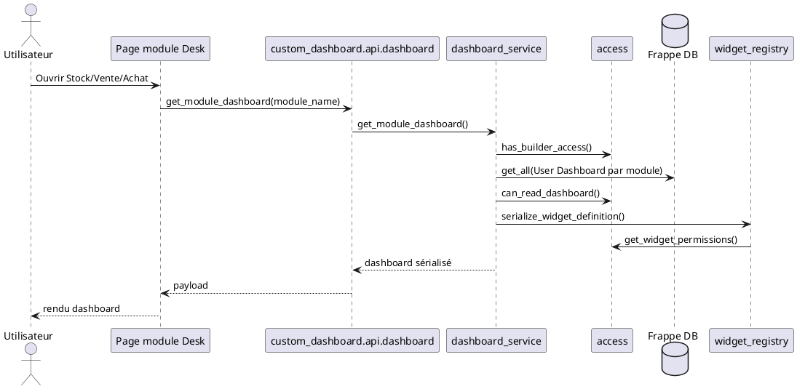
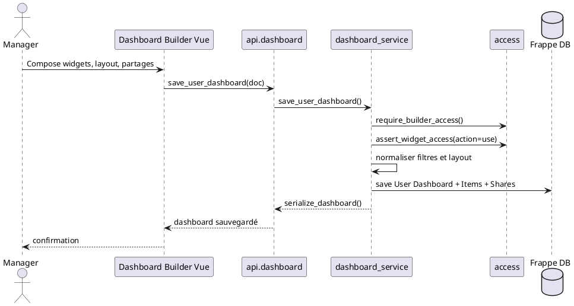
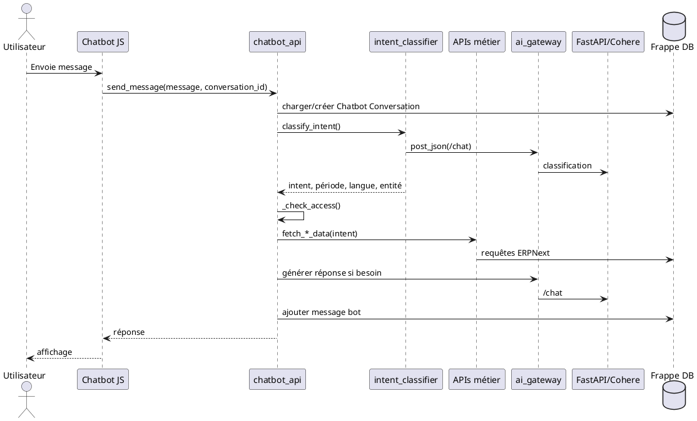
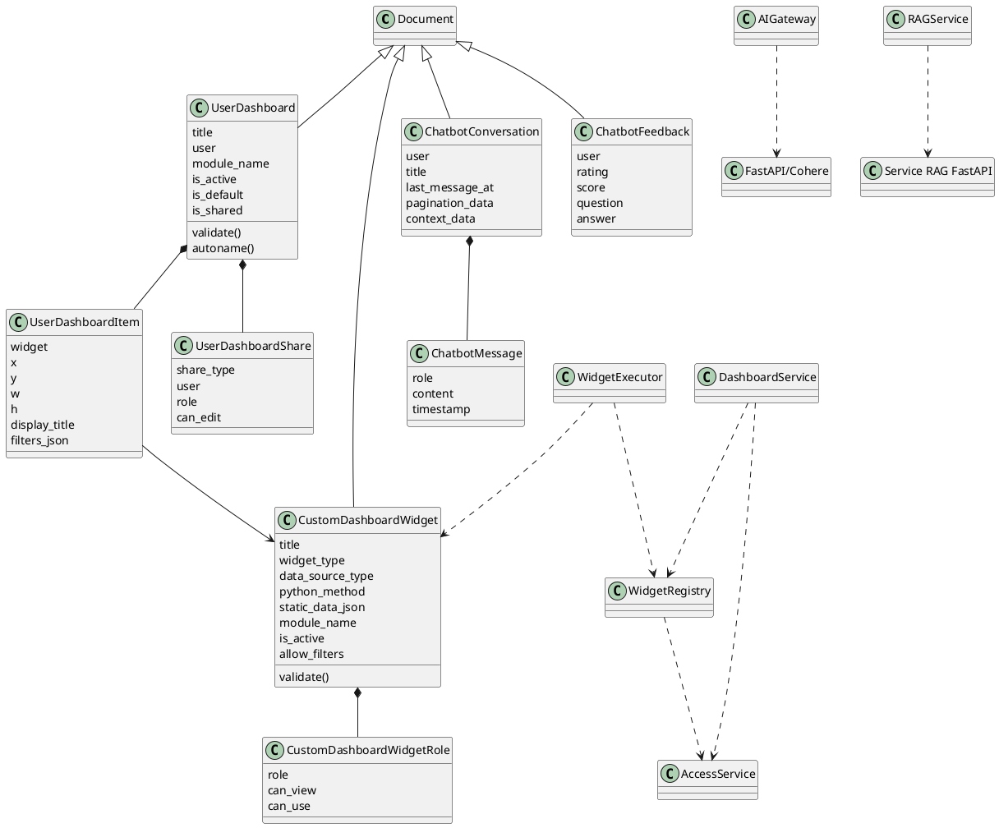
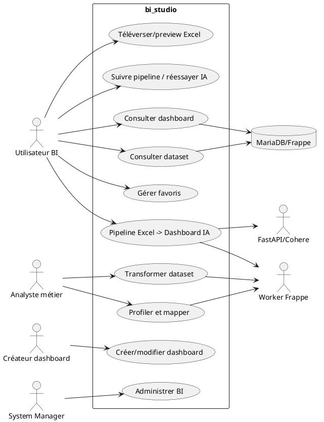
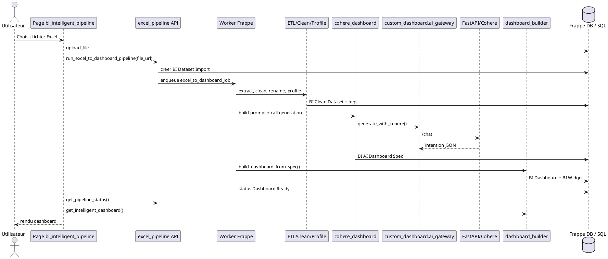
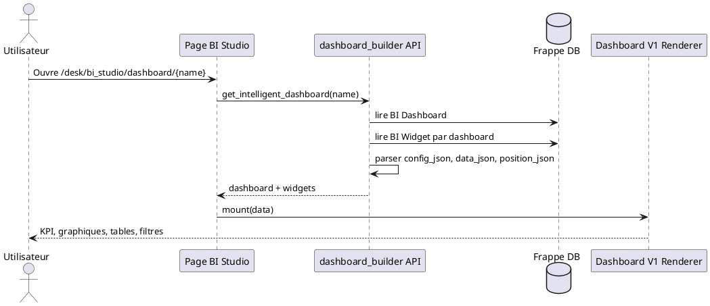
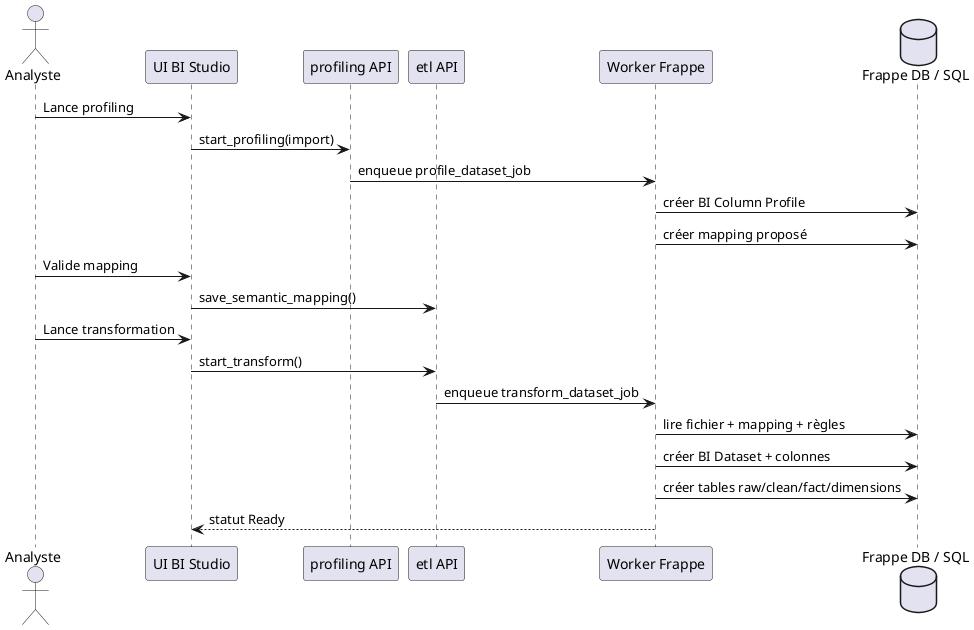
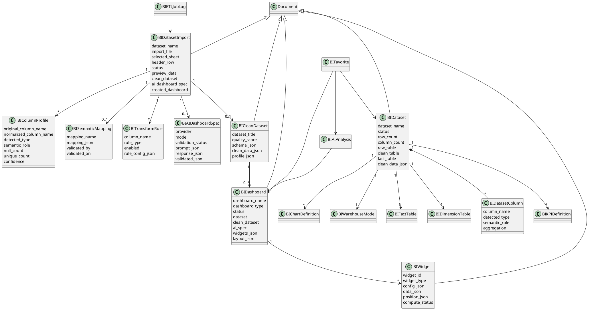

# Analyse fonctionnelle et conceptuelle - custom_dashboard et bi_studio

Document établi à partir de l'analyse du code local des applications Frappe `custom_dashboard` et `bi_studio`.

## 1. Module `custom_dashboard`

### 1.1 Présentation générale

| Élément | Analyse |
|---|---|
| Objectif | Fournir des tableaux de bord ERP personnalisables, des widgets métier exécutables, des dashboards Stock/Vente/Achat, un dashboard global, un dashboard administrateur et un assistant IA intégré. |
| Rôle global | Couche d'expérience décisionnelle opérationnelle au-dessus d'ERPNext/Frappe. Le module expose des pages Desk, des DocTypes de configuration, des APIs whitelisted et un pont vers un service FastAPI/Cohere/RAG. |
| Fonctionnalités principales | Catalogue de widgets, exécution de widgets Python ou JSON statique, création de dashboards utilisateur, partage par utilisateur ou rôle, dashboards module (`Stock`, `Selling`, `Buying`), gestion admin des dashboards et widgets, chatbot conversationnel, feedback, indexation RAG de DocTypes ERP. |
| Utilisateurs ciblés | Administrateur système, Dashboard Admin, Dashboard Manager, Dashboard Consumer, utilisateurs ERP métiers, assistant IA externe FastAPI/Cohere/RAG. |

### 1.2 Acteurs

| Acteur | Type | Rôle |
|---|---|---|
| Utilisateur ERP authentifié | Principal | Accède aux dashboards autorisés et au chatbot. |
| Dashboard Consumer | Principal | Consulte les dashboards et exécute les widgets autorisés. |
| Dashboard Manager | Principal | Crée/modifie ses dashboards et utilise les widgets disponibles. |
| Dashboard Admin | Principal | Administre widgets, dashboards, activation, partage et catégories. |
| System Manager / Administrator | Principal | Accès complet aux fonctions admin et statistiques système. |
| Service FastAPI/Cohere | Secondaire | Classification, génération de réponses, génération d'insights IA. |
| Service RAG FastAPI | Secondaire | Indexe/supprime les documents ERP configurés pour la recherche augmentée. |
| Base de données Frappe/ERPNext | Secondaire | Stocke DocTypes, données ERP, conversations et métriques. |

### 1.3 Cas d'utilisation détaillés

#### CD-UC1 - Consulter un dashboard métier Stock/Vente/Achat

| Rubrique | Détail |
|---|---|
| Acteur principal | Dashboard Consumer / Manager / Admin |
| Acteurs secondaires | UI Frappe, `dashboard_service`, `access`, DocType `User Dashboard`, widgets |
| Description | L'utilisateur ouvre une page module; le système détermine si un dashboard custom actif et lisible remplace ou complète l'affichage. |
| Objectif | Accéder rapidement aux indicateurs d'un module ERP. |
| Pré-conditions | Utilisateur connecté; rôle dans `Dashboard Admin`, `Dashboard Manager` ou `Dashboard Consumer`; dashboard module existant pour `Stock`, `Selling` ou `Buying`. |
| Post-condition | Dashboard sérialisé avec seulement les widgets lisibles par l'utilisateur. |
| Scénario nominal | 1. L'UI lit `bootinfo.custom_dashboard_modules`; 2. appelle `get_module_dashboard(module_name)`; 3. le service valide le module; 4. recherche le dashboard par `module_name`; 5. vérifie activation et droits; 6. sérialise les items; 7. chaque widget est filtré par rôle; 8. l'UI affiche le dashboard. |
| Scénarios alternatifs | Dashboard inactif: l'admin reçoit le contenu, les autres un message désactivé; aucun dashboard: retour `None`; widget non autorisé: il est retiré du payload. |
| Erreurs / exceptions | Module non supporté; rôle insuffisant; dashboard supprimé; widget inactif; JSON de filtre invalide au rendu de preview. |
| Résultat attendu | Un dashboard lisible, cohérent avec les rôles et limité au module demandé. |

#### CD-UC2 - Créer ou modifier un dashboard utilisateur

| Rubrique | Détail |
|---|---|
| Acteur principal | Dashboard Manager ou Dashboard Admin |
| Acteurs secondaires | Page `dashboard_builder`, `dashboard_service`, `widget_registry`, DocTypes `User Dashboard`, `User Dashboard Item`, `User Dashboard Share` |
| Description | L'utilisateur compose un tableau de bord à partir du catalogue de widgets autorisés. |
| Objectif | Personnaliser une vue décisionnelle métier. |
| Pré-conditions | Accès builder; widgets actifs et utilisables; payload JSON valide. |
| Post-condition | Dashboard créé ou mis à jour; items normalisés; partages enregistrés si autorisés. |
| Scénario nominal | 1. L'UI charge `list_available_widgets`; 2. l'utilisateur ajoute des widgets; 3. configure layout, titres et filtres; 4. sauvegarde via `save_user_dashboard`; 5. le service vérifie les droits d'écriture; 6. valide chaque widget avec action `use`; 7. normalise tailles `x/y/w/h`; 8. enregistre le document; 9. retourne la version sérialisée. |
| Scénarios alternatifs | Création d'un dashboard module par admin: le module devient partagé et par défaut; dashboard existant: vérification `can_write`; partage désactivé: seules les métadonnées de base sont modifiées. |
| Erreurs / exceptions | Titre manquant; widget hors module; widget inactif; filtre non JSON; utilisateur non autorisé à éditer. |
| Résultat attendu | Un dashboard exploitable, filtré et partageable selon les droits. |

#### CD-UC3 - Exécuter un widget

| Rubrique | Détail |
|---|---|
| Acteur principal | Dashboard Consumer / Manager |
| Acteurs secondaires | `widget_executor`, `widget_registry`, ERPNext DB |
| Description | Le frontend demande les données d'un widget affiché ou en preview. |
| Objectif | Calculer KPI, graphique, table ou insight selon les filtres. |
| Pré-conditions | Widget actif; rôle utilisateur avec `can_use`; méthode Python callable ou JSON statique valide. |
| Post-condition | Données normalisées `{widget,title,type,data}` renvoyées. |
| Scénario nominal | 1. L'UI appelle `get_widget_data`; 2. `assert_widget_access` valide le rôle; 3. les filtres sont normalisés selon le schéma; 4. la source est exécutée (`python_method` ou `static_json`); 5. le résultat est renvoyé. |
| Scénarios alternatifs | Source statique: lecture `static_data_json`; widget IA: agrégation de contextes métiers puis appel FastAPI/Cohere avec cache Redis. |
| Erreurs / exceptions | Méthode introuvable; source non supportée; JSON statique invalide; service IA indisponible; requête ERPNext sans données. |
| Résultat attendu | Données prêtes à rendre dans une carte, un graphique, une table ou un bloc IA. |

#### CD-UC4 - Administrer les widgets

| Rubrique | Détail |
|---|---|
| Acteur principal | Dashboard Admin / System Manager |
| Acteurs secondaires | Page `widget_management`, `widget_registry`, DocType `Custom Dashboard Widget Role` |
| Description | L'administrateur contrôle activation, catégorie et matrice de rôles des widgets. |
| Objectif | Gouverner l'accès aux indicateurs. |
| Pré-conditions | Rôle admin dashboard. |
| Post-condition | Widget mis à jour; cache document vidé; matrice des rôles sauvegardée. |
| Scénario nominal | 1. L'UI charge `list_admin_widgets`; 2. l'admin ouvre un widget; 3. récupère la matrice complète via `get_widget_admin_definition`; 4. modifie `is_active`, description et droits; 5. sauvegarde via `save_widget_access`; 6. le service reconstruit les lignes de rôles. |
| Scénarios alternatifs | Désactivation directe via `admin_toggle_widget_active`; filtrage par catégorie Stock/Vente/Achat. |
| Erreurs / exceptions | Widget introuvable; rôle manquant; utilisateur non admin; doublons de rôles au niveau validation DocType. |
| Résultat attendu | Catalogue cohérent, avec droits `can_view` et `can_use` explicites. |

#### CD-UC5 - Administrer les dashboards

| Rubrique | Détail |
|---|---|
| Acteur principal | Dashboard Admin / System Manager |
| Acteurs secondaires | Page `dashboard_management`, `dashboard_service`, `User Dashboard Share` |
| Description | L'admin liste, active, désactive, duplique, supprime ou configure les dashboards. |
| Objectif | Piloter les dashboards publiés et leurs accès. |
| Pré-conditions | Rôle admin dashboard. |
| Post-condition | Dashboard et partages mis à jour; défauts utilisateur/module recalculés. |
| Scénario nominal | 1. L'admin liste via `list_admin_dashboards`; 2. ouvre un détail; 3. modifie titre, propriétaire, catégorie, activation, partages; 4. sauvegarde via `admin_save_dashboard`; 5. le service applique les partages; 6. met à jour les dashboards par défaut. |
| Scénarios alternatifs | `admin_duplicate_dashboard` clone les items; `admin_delete_dashboard` supprime définitivement; dashboard module vide les partages et force `is_shared`. |
| Erreurs / exceptions | Dashboard introuvable; titre obligatoire; catégorie non reconnue; suppression d'un dashboard encore référencé côté UI. |
| Résultat attendu | Administration centralisée des tableaux visibles par les utilisateurs. |

#### CD-UC6 - Utiliser le chatbot ERP/RAG

| Rubrique | Détail |
|---|---|
| Acteur principal | Utilisateur ERP authentifié |
| Acteurs secondaires | `chatbot_api`, `chatbot_proxy`, `intent_classifier`, APIs métiers, FastAPI/Cohere, RAG, DocTypes conversation/feedback |
| Description | L'utilisateur pose une question; le système classe l'intention, contrôle les rôles, récupère les données ERP ou délègue au service IA. |
| Objectif | Obtenir des réponses métier contextualisées en français ou anglais. |
| Pré-conditions | Utilisateur connecté pour les données métier; secrets JWT configurés pour la v2/FastAPI; rôles ERP adaptés. |
| Post-condition | Message utilisateur et réponse bot stockés; feedback possible. |
| Scénario nominal | 1. L'utilisateur envoie un message; 2. conversation créée ou chargée; 3. classification d'intention via FastAPI puis fallback mots-clés; 4. contrôle d'accès par domaine; 5. appel API métier Stock/Vente/Achat/RH/Projet/Comptabilité; 6. génération de réponse ou résumé; 7. sauvegarde des messages. |
| Scénarios alternatifs | Demande "suite": pagination conversationnelle; message général: réponse FastAPI sans données structurées; streaming v2: préparation JWT puis `finish_stream_v2`. |
| Erreurs / exceptions | Guest non autorisé; rôle métier insuffisant; service IA indisponible; conversation d'un autre utilisateur; feedback invalide. |
| Résultat attendu | Réponse concise, non inventée, avec traçabilité conversationnelle et feedback. |

#### CD-UC7 - Consulter les dashboards global et administrateur

| Rubrique | Détail |
|---|---|
| Acteur principal | Utilisateur autorisé / System Manager |
| Acteurs secondaires | Pages `global_dashboard`, `admin_dashboard`, base Frappe |
| Description | Consultation de métriques globales ERP ou d'administration système. |
| Objectif | Donner une vue d'ensemble transversale et technique. |
| Pré-conditions | Accès dashboard global selon configuration; System Manager pour admin dashboard. |
| Post-condition | Indicateurs agrégés affichés. |
| Scénario nominal | 1. L'utilisateur ouvre la page; 2. la permission d'icône est évaluée; 3. l'API collecte statistiques; 4. l'UI rend cartes et graphiques. |
| Scénarios alternatifs | Si `Dashboard Access Control` est absent, le code global semble autoriser l'accès par défaut; pour admin dashboard, `frappe.only_for` bloque hors System Manager/Administrator. |
| Erreurs / exceptions | DocTypes système absents; configuration d'accès manquante; rôle insuffisant. |
| Résultat attendu | Vue globale ou admin uniquement pour les profils prévus. |

### 1.4 Diagramme de cas d'utilisation

### 1.5 Diagrammes de séquence

#### CD-S1 - Consultation d'un dashboard module

Ce flux protège l'accès au dashboard et supprime du payload les widgets que l'utilisateur ne peut pas voir.

#### CD-S2 - Sauvegarde d'un dashboard personnalisé

Le service centralise les validations: titre, module supporté, compatibilité widget/module, partage et droits d'édition.

#### CD-S3 - Question au chatbot métier

Le chatbot combine règles métier, permissions ERP, appels de données structurées et génération IA contrôlée.

### 1.6 Diagramme de classes

Responsabilités principales: `AccessService` protège les lectures/écritures; `DashboardService` orchestre les dashboards; `WidgetRegistry` expose les métadonnées; `WidgetExecutor` calcule les données; `AIGateway` mutualise les appels IA; `RAGService` synchronise certains DocTypes ERP vers l'index externe.

## 2. Module `bi_studio`

### 2.1 Présentation générale

| Élément | Analyse |
|---|---|
| Objectif | Transformer des fichiers Excel en datasets analysables, générer des dashboards BI, calculer des KPI/graphiques et offrir un pipeline IA de dashboard automatique. |
| Rôle global | Module BI analytique autonome, complémentaire à ERPNext: il ingère des données tabulaires, les nettoie, les profile, crée des tables analytiques SQL et rend des dashboards. |
| Fonctionnalités principales | Import Excel, preview, pipeline intelligent asynchrone, nettoyage/profiling, mapping sémantique, transformation, entrepôt analytique, dashboards manuels et IA, widgets persistés, favoris, export dataset/PNG, administration BI. |
| Utilisateurs ciblés | Utilisateur BI (`User du wizio`), analyste métier, créateur de dashboard, administrateur BI/System Manager. |

### 2.2 Acteurs

| Acteur | Type | Rôle |
|---|---|---|
| Utilisateur BI | Principal | Importe des fichiers, consulte ses datasets, dashboards et favoris. |
| Analyste métier | Principal | Valide le mapping sémantique, transforme et interprète les données. |
| Créateur de dashboard | Principal | Crée, modifie, publie et exporte des dashboards. |
| System Manager / Administrator | Principal | Supervise tous les datasets, dashboards, analyses et imports. |
| Worker Frappe / Background Job | Secondaire | Exécute profiling, transformation et pipeline Excel -> dashboard. |
| Service FastAPI/Cohere via `custom_dashboard.ai_gateway` | Secondaire | Propose l'intention de dashboard IA. |
| Base MariaDB/Frappe | Secondaire | Stocke DocTypes et tables analytiques dynamiques `raw`, `clean`, `fact`, dimensions. |
| Système de fichiers Frappe | Secondaire | Stocke les fichiers Excel et exports. |

### 2.3 Cas d'utilisation détaillés

#### BI-UC1 - Téléverser et prévisualiser un fichier Excel

| Rubrique | Détail |
|---|---|
| Acteur principal | Utilisateur BI |
| Acteurs secondaires | UI `bi_intelligent_pipeline` ou importeur, File Frappe, `importer.py` |
| Description | L'utilisateur sélectionne un fichier `.xlsx/.xls`; le système détecte feuille, ligne d'en-tête et colonnes. |
| Objectif | Vérifier que le fichier est exploitable avant traitement. |
| Pré-conditions | Utilisateur connecté; fichier Excel <= 10 Mo pour l'importeur preview; lignes <= `MAX_IMPORT_ROWS` (1000). |
| Post-condition | Un `BI Dataset Import` en statut `Uploaded` contient preview, feuille, header row, dimensions. |
| Scénario nominal | 1. L'utilisateur téléverse le fichier via `/api/method/upload_file`; 2. appelle `upload_and_preview_excel`; 3. le backend lit les feuilles; 4. détecte l'en-tête; 5. normalise les colonnes; 6. crée `BI Dataset Import`; 7. retourne preview et métadonnées. |
| Scénarios alternatifs | Feuille/header fournis manuellement; mise à jour de preview via `update_import_preview`; pipeline intelligent saute la preview détaillée et crée directement l'import. |
| Erreurs / exceptions | Fichier introuvable; extension/lecture Excel invalide; fichier trop volumineux; aucune colonne; dépassement du nombre de lignes. |
| Résultat attendu | Import prêt pour profiling, mapping, transformation ou pipeline automatique. |

#### BI-UC2 - Lancer le pipeline intelligent Excel -> dashboard IA

| Rubrique | Détail |
|---|---|
| Acteur principal | Utilisateur BI / Analyste |
| Acteurs secondaires | `excel_pipeline`, worker Frappe, `cohere_dashboard`, `dashboard_builder`, `BI ETL Job Log`, `custom_dashboard.ai_gateway` |
| Description | Le fichier Excel est traité de bout en bout pour produire un dashboard publié. |
| Objectif | Automatiser extraction, nettoyage, profiling, intention IA, validation JSON et rendu dashboard. |
| Pré-conditions | Fichier téléversé; utilisateur connecté; dépendance `custom_dashboard` installée pour l'IA; pandas disponible; worker long actif. |
| Post-condition | `BI Dataset Import` lié à `BI Clean Dataset`, `BI AI Dashboard Spec` et `BI Dashboard`; logs ETL créés. |
| Scénario nominal | 1. UI appelle `run_excel_to_dashboard_pipeline`; 2. création de `BI Dataset Import`; 3. enqueue `excel_to_dashboard_job`; 4. extraction Excel; 5. nettoyage; 6. renommage lisible; 7. profiling + qualité; 8. sauvegarde `BI Clean Dataset`; 9. prompt Cohere; 10. validation/construction `dashboard.v1`; 11. création `BI Dashboard` et `BI Widget`; 12. statut `Dashboard Ready`. |
| Scénarios alternatifs | Cohere échoue: fallback déterministe; JSON IA invalide: tentative de reconstruction depuis l'intention; réessai IA via `retry_ai_generation`. |
| Erreurs / exceptions | Extraction impossible; nettoyage échoue; validation JSON impossible; worker indisponible; secret IA absent dans `custom_dashboard`; dashboard non créé. |
| Résultat attendu | Dashboard IA publié et immédiatement rendu par `dashboard_v1_renderer`. |

#### BI-UC3 - Suivre un pipeline et réessayer la génération IA

| Rubrique | Détail |
|---|---|
| Acteur principal | Utilisateur BI |
| Acteurs secondaires | UI polling, `get_pipeline_status`, `BI ETL Job Log` |
| Description | L'utilisateur visualise les étapes du pipeline et relance uniquement l'étape IA si les données nettoyées existent. |
| Objectif | Donner de la transparence et éviter de relancer tout l'ETL. |
| Pré-conditions | `BI Dataset Import` existant. |
| Post-condition | Statut affiché; en cas de réessai réussi, nouveau dashboard/spec liés. |
| Scénario nominal | 1. UI poll toutes les 2,5 secondes; 2. lit statut et logs; 3. affiche chaque étape; 4. si prêt, charge le dashboard intelligent; 5. si échec avec clean dataset, propose réessai IA. |
| Scénarios alternatifs | Échec final: affichage du message; réessai: statut repasse `Waiting AI`. |
| Erreurs / exceptions | Import introuvable; logs absents; accès insuffisamment vérifié si l'API reçoit un nom d'import tiers. |
| Résultat attendu | Suivi clair du traitement et récupération partielle possible. |

#### BI-UC4 - Profilage, mapping sémantique et transformation manuelle

| Rubrique | Détail |
|---|---|
| Acteur principal | Analyste métier |
| Acteurs secondaires | `profiling.py`, `etl.py`, `BI Column Profile`, `BI Semantic Mapping`, `BI Transform Rule` |
| Description | Mode contrôlé: profiler les colonnes, valider les rôles sémantiques, appliquer des règles, générer un `BI Dataset`. |
| Objectif | Corriger manuellement le sens métier des colonnes avant création de tables analytiques. |
| Pré-conditions | `BI Dataset Import` accessible; preview/import valide. |
| Post-condition | `BI Dataset` prêt, tables analytiques créées, score qualité calculé. |
| Scénario nominal | 1. L'utilisateur lance `start_profiling`; 2. worker crée les profils colonnes; 3. mapping proposé; 4. utilisateur sauvegarde `save_semantic_mapping`; 5. lance `start_transform`; 6. règles de transformation appliquées; 7. clean dataframe construit; 8. `BI Dataset` et tables SQL créés. |
| Scénarios alternatifs | Règles `Trim Text`, `Convert Date`, `Convert Number`, `Fill Missing`, `Drop Column`, `Remove Duplicates`; colonnes non incluses marquées `Ignored`. |
| Erreurs / exceptions | Mapping vide; rôle/type invalide; mesure non numérique; dimension date non Date; règle sur colonne manquante; formule custom ignorée pour sécurité. |
| Résultat attendu | Dataset propre, typé et analytiquement requêtable. |

#### BI-UC5 - Consulter, renommer, exporter ou supprimer un dataset

| Rubrique | Détail |
|---|---|
| Acteur principal | Utilisateur BI propriétaire / Admin |
| Acteurs secondaires | `dataset.py`, `query.py`, `export.py`, `cleanup.py` |
| Description | Gestion du cycle de vie d'un dataset prêt. |
| Objectif | Explorer les données nettoyées, KPI, graphiques et maintenir le référentiel. |
| Pré-conditions | Dataset accessible selon propriétaire ou admin. |
| Post-condition | Données consultées/exportées ou dataset supprimé en cascade. |
| Scénario nominal | 1. L'utilisateur liste `get_datasets`; 2. ouvre `get_dataset_detail`; 3. `query.py` lit colonnes et lignes clean; 4. KPI et graphiques sont calculés; 5. l'utilisateur peut renommer/exporter/supprimer. |
| Scénarios alternatifs | Recherche, tri, pagination; favori enrichi; suppression cascade avec drop des tables SQL. |
| Erreurs / exceptions | Table clean manquante; champ invalide; agrégation non autorisée; accès propriétaire refusé. |
| Résultat attendu | Dataset exploitable avec vue tabulaire, indicateurs et actions de maintenance. |

#### BI-UC6 - Créer ou modifier un dashboard manuel

| Rubrique | Détail |
|---|---|
| Acteur principal | Créateur de dashboard |
| Acteurs secondaires | `dashboard.py`, `BI Dashboard`, `BI Dashboard Widget`, `query.py` |
| Description | L'utilisateur construit un dashboard à partir d'un dataset existant. |
| Objectif | Produire une visualisation personnalisée non forcément générée par IA. |
| Pré-conditions | Dataset accessible; widgets JSON cohérents. |
| Post-condition | Dashboard `Draft` ou `Published`; lignes enfants synchronisées. |
| Scénario nominal | 1. L'utilisateur choisit un dataset; 2. définit widgets/layout/filtres; 3. appelle `create_dashboard`; 4. le backend crée `BI Dashboard`; 5. `sync_widget_rows` remplit les enfants; 6. l'utilisateur modifie ou publie. |
| Scénarios alternatifs | Mise à jour via `update_dashboard`; publication via `publish_dashboard`; export PNG; suppression cascade. |
| Erreurs / exceptions | Dataset inaccessible; widget JSON invalide; champ/agrégation non valide au rendu. |
| Résultat attendu | Dashboard manuel consultable et exportable. |

#### BI-UC7 - Consulter un dashboard intelligent ou legacy

| Rubrique | Détail |
|---|---|
| Acteur principal | Utilisateur BI propriétaire / Admin |
| Acteurs secondaires | `dashboard_builder.get_intelligent_dashboard`, renderer JS, `BI Widget` |
| Description | Le frontend charge un dashboard IA avec widgets déjà calculés ou un dashboard legacy recalculé depuis `BI Dashboard Widget`. |
| Objectif | Visualiser les résultats analytiques. |
| Pré-conditions | Dashboard existant; widgets calculés; renderer chargé. |
| Post-condition | Dashboard rendu avec KPI, charts, tables, filtres et JSON IA consultable. |
| Scénario nominal | 1. UI appelle `get_intelligent_dashboard`; 2. charge `BI Dashboard`; 3. lit les `BI Widget`; 4. parse config/data/position; 5. monte le renderer; 6. l'utilisateur ouvre JSON, ETL ou dashboard. |
| Scénarios alternatifs | Dashboard legacy: `get_dashboard_detail` recalcule KPI/charts depuis `BI Dataset`; widget en erreur: message d'erreur affiché. |
| Erreurs / exceptions | Widget data JSON invalide; dashboard non autorisé; absence de vérification explicite sur certains endpoints intelligents. |
| Résultat attendu | Rendu BI interactif et traçable. |

#### BI-UC8 - Gérer les favoris

| Rubrique | Détail |
|---|---|
| Acteur principal | Utilisateur BI |
| Acteurs secondaires | `favorites.py`, `BI Favorite` |
| Description | L'utilisateur marque datasets, dashboards ou analyses IA comme favoris. |
| Objectif | Accéder rapidement aux objets BI importants. |
| Pré-conditions | Objet cible accessible; utilisateur connecté. |
| Post-condition | Favori créé ou supprimé. |
| Scénario nominal | 1. L'utilisateur clique favori; 2. API valide le type; 3. vérifie l'accès à l'objet; 4. supprime si existant ou crée `BI Favorite`; 5. la liste des favoris retourne routes et tailles. |
| Scénarios alternatifs | Type `BI Dataset`, `BI Dashboard`, `BI AI Analysis`; suppression cascade lors de suppression objet. |
| Erreurs / exceptions | Type non supporté; objet inaccessible; favori orphelin si suppression hors cascade. |
| Résultat attendu | Liste personnelle de raccourcis BI. |

#### BI-UC9 - Administrer BI Studio

| Rubrique | Détail |
|---|---|
| Acteur principal | System Manager / Administrator |
| Acteurs secondaires | `admin.py`, `cleanup.py`, tous DocTypes BI |
| Description | L'admin visualise des statistiques globales et gère tous les objets BI. |
| Objectif | Gouvernance, supervision et nettoyage. |
| Pré-conditions | Utilisateur admin. |
| Post-condition | Synthèse calculée ou objet supprimé en cascade. |
| Scénario nominal | 1. L'admin ouvre la section Administration; 2. appelle `get_admin_dashboard_summary`; 3. consulte datasets, dashboards, analyses, import jobs; 4. supprime si nécessaire via endpoints admin. |
| Scénarios alternatifs | Groupement imports par jour/semaine/mois; liste des imports récents. |
| Erreurs / exceptions | Rôle insuffisant; métriques d'import partiellement incomplètes si le pipeline intelligent n'alimente pas `BI Import Job`. |
| Résultat attendu | Supervision transversale des ressources BI. |

### 2.4 Diagramme de cas d'utilisation

### 2.5 Diagrammes de séquence

#### BI-S1 - Pipeline intelligent Excel vers dashboard

Le pipeline est asynchrone et journalisé étape par étape dans `BI ETL Job Log`.

#### BI-S2 - Consultation d'un dashboard intelligent

Les widgets IA sont persistés avec leurs données calculées; le rendu évite de recalculer à chaque affichage.

#### BI-S3 - Profilage et transformation manuelle

Ce mode donne plus de contrôle métier que le pipeline automatique, notamment sur les rôles sémantiques et règles de nettoyage.

### 2.6 Diagramme de classes

Responsabilités principales: `BI Dataset Import` suit le fichier et le pipeline; `BI Clean Dataset` conserve les données nettoyées et le schéma; `BI Dashboard` décrit la vue; `BI Widget` persiste le rendu calculé; `BI Dataset` représente le modèle analytique SQL; les tables `BI Warehouse Model`, `BI Fact Table`, `BI Dimension Table` documentent l'entrepôt généré.

## 3. Analyse globale du projet

### 3.1 Interactions entre `custom_dashboard` et `bi_studio`

| Interaction | Description |
|---|---|
| Dépendance IA | `bi_studio.api.cohere_dashboard` importe dynamiquement `custom_dashboard.services.ai_gateway`. Donc le pipeline IA BI dépend fonctionnellement de `custom_dashboard` pour signer les JWT et appeler FastAPI/Cohere. |
| Plateforme commune | Les deux modules utilisent Frappe DocTypes, whitelisted APIs, Desk pages, permissions hookées et MariaDB. |
| Données ERP | `custom_dashboard` lit directement les DocTypes ERPNext pour ses widgets et chatbot; `bi_studio` travaille plutôt sur fichiers Excel et tables analytiques générées. |
| IA/RAG | `custom_dashboard` porte le chatbot, le gateway IA et l'indexation RAG; `bi_studio` réutilise le gateway pour générer une intention de dashboard. |
| Navigation | Les modules exposent des pages Desk séparées; pas de partage direct de dashboards entre `User Dashboard` et `BI Dashboard`. |

### 3.2 Flux de données principaux

1. Flux dashboard opérationnel: ERPNext DB -> `widget_executor` -> `Custom Dashboard Widget` -> `User Dashboard Item` -> page dashboard.
2. Flux chatbot: message utilisateur -> conversation -> classification -> contrôle d'accès -> APIs métier ERP -> FastAPI/Cohere/RAG -> réponse -> feedback éventuel.
3. Flux RAG: événement DocType ERP -> `rag.on_rag_doc_update` -> job Frappe -> service RAG FastAPI -> index externe.
4. Flux BI automatique: fichier Excel -> `BI Dataset Import` -> extraction/nettoyage/profiling -> `BI Clean Dataset` -> intention Cohere -> `BI AI Dashboard Spec` -> `BI Dashboard` + `BI Widget`.
5. Flux BI manuel: import Excel -> profiling -> mapping validé -> transformation -> `BI Dataset` -> tables raw/clean/fact/dimensions -> KPI/charts/dashboards.

### 3.3 Points critiques et risques fonctionnels

| Risque | Impact | Amélioration proposée |
|---|---|---|
| Dépendance `bi_studio` -> `custom_dashboard.ai_gateway` non déclarée explicitement dans `pyproject` ou `hooks.required_apps`. | Pipeline IA BI cassé si `custom_dashboard` absent. | Déclarer la dépendance fonctionnelle et afficher un diagnostic de configuration dans l'UI. |
| Certains endpoints intelligents BI (`get_pipeline_status`, `get_intelligent_dashboard`, `get_ai_spec_json`) ne passent pas systématiquement par `ensure_*_access`. | Risque de lecture par nom d'objet si un utilisateur devine un identifiant. | Ajouter `ensure_dataset_import_access`, `ensure_dashboard_access`, et contrôle d'accès sur la spec IA. |
| Double modèle BI: `BI Dataset` historique avec tables SQL et `BI Clean Dataset` du pipeline IA. | Les listes/admins fondées sur `BI Dataset` peuvent mal représenter les dashboards IA qui référencent surtout `clean_dataset`. | Unifier le modèle ou créer des liens explicites `BI Dataset` pour les pipelines IA. |
| Admin BI compte les imports via `BI Import Job`, alors que le pipeline intelligent utilise `BI Dataset Import` + `BI ETL Job Log`. | Statistiques admin incomplètes. | Consolider les métriques d'import sur les deux sources ou migrer vers un modèle unique. |
| Données nettoyées du pipeline IA stockées en JSON inline dans `BI Clean Dataset`. | Limite de volume, mémoire et taille DocType. | Basculer vers tables SQL warehouse comme indiqué par le TODO. |
| Tables SQL dynamiques BI. | Risque de tables orphelines si suppression partielle ou erreur DDL. | Ajouter audits périodiques et transaction/cleanup renforcés. |
| `global_dashboard` référence `Dashboard Access Control`, non visible dans l'arborescence analysée. | Si le DocType est absent, le code autorise par défaut l'accès global. | Ajouter le DocType ou remplacer par les rôles `Dashboard*` existants. |
| Secrets IA/RAG dans site_config requis. | Chatbot, streaming, RAG ou pipeline IA peuvent échouer sans message métier clair. | Ajouter page de santé configuration IA/RAG. |

### 3.4 Améliorations possibles

1. Créer une page "Santé BI/IA" vérifiant `chatbot_jwt_secret`, URLs FastAPI, RAG key, worker long, pandas et dépendance `custom_dashboard`.
2. Harmoniser les permissions BI: tous les endpoints whitelisted doivent appeler un `ensure_*_access`.
3. Unifier `BI Dataset` et `BI Clean Dataset`, ou documenter formellement deux modes: legacy/manual vs intelligent.
4. Ajouter des tests de permission pour endpoints sensibles et des tests de cascade supprimant aussi les tables SQL.
5. Exposer un modèle commun d'observabilité: logs pipeline, erreurs IA, temps de calcul widgets, cache hits IA.
6. Pour `custom_dashboard`, documenter les rôles et fournir un écran d'audit "qui voit quoi".
7. Déclarer clairement les modules supportés Stock/Selling/Buying et leur mapping d'étiquettes Stock/Vente/Achat.

## 4. Synthèse finale

| Module | Rôle |
|---|---|
| `custom_dashboard` | Module de dashboard opérationnel et assistant IA ERP. Il exploite les données ERPNext existantes, propose des widgets contrôlés par rôles, des dashboards configurables et un chatbot connecté à FastAPI/Cohere/RAG. |
| `bi_studio` | Module BI analytique. Il transforme des fichiers Excel en datasets et dashboards, avec pipeline IA automatique, mode manuel de profiling/mapping/transformation, warehouse SQL et administration BI. |

Acteurs principaux: `Dashboard Admin`, `Dashboard Manager`, `Dashboard Consumer`, utilisateur BI, analyste métier, System Manager.  
Fonctionnalités clés: widgets ERP, dashboards personnalisés, gestion d'accès, chatbot/RAG, import Excel, ETL, profiling, mapping, génération IA, dashboards BI, favoris, administration.  
Architecture fonctionnelle globale: deux apps Frappe séparées mais complémentaires. `custom_dashboard` sert de socle IA opérationnel et dashboard ERP; `bi_studio` sert de studio BI et réutilise le gateway IA de `custom_dashboard` pour générer des dashboards analytiques à partir de fichiers.
